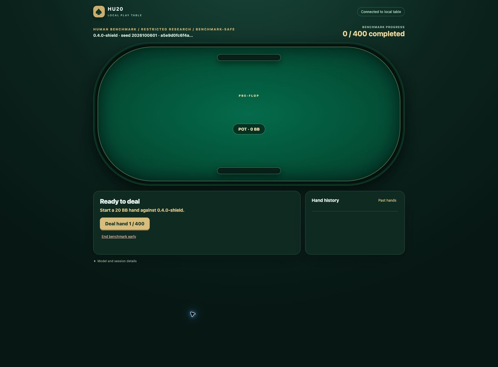

# Luna versus 0.4.0-shield in native Chrome

**Completed October 6:** Luna finished 400 hands at −82 BB (−20.50 BB/100). The [result and retrospective](reports/luna-shield-chrome.md) preserve native replay verification and the **failed browser protocol audit**: the actual player did not receive this frozen text, emitted none of the planned metadata and used tools outside its prescribed boundary. The owned service and resource sampler have stopped; private evidence remains retained.

This preparation prescribed an owner-launched, browser-only repetition of [#127](https://github.com/dberweger2017/deepcfr-texas-no-limit-holdem-6-players/pull/127), against #171's first-lineage CFR+ **traverser-reach average**, called **0.4.0-shield / 0.4.0-s**. The owner chose **400 hands before play**. The player was a fresh **GPT-6 Luna / HIGH** session, launched separately by the owner rather than as a supervising agent's child. The prepared original poker prompt is unchanged; the technical harness selects native Chrome and an already prepared table. The instructions below record the intended protocol for review and future reproduction.

The [frozen configuration](../configs/diagnostics/luna-shield-chrome.json) identifies the artifact, game, target, context, browser, stopping rule and SHA256 hashes of the prompt/harness. The [complete text to paste into the fresh player session](luna-shield-chrome-player.txt) includes both. Paste that text yourself; Luna must not read local files or the repository. Do not give Luna the earlier results or strategic coaching.

## Game and stopping rule

Heads-up, no rake/ante, 2,000 chips per seat (20 BB), blinds 50/100. Restricted native-reopening actions, button alternating with human/seat 0 first; stacks reset each hand. The authoritative journal sums settled hand payoffs, not stack resets. Target 400; no hand 401. Cumulative score and lookup diagnostics stay hidden until the benchmark ends. Visible per-hand outcomes remain available as before.

The first lineage, seed **2026100601**, is fixed without outcome selection. Its export is **143,429,027 bytes**, SHA256 `a5e9d0fc6f4a448640f52f508187f779e43a0a8fd41158207f03de82adc219e1`, path `policies/O-2026100601.average.jsonl.gz` in the retained #171 research root. Its source checkpoint SHA256 is `1d162266e55d9098c83415f65e487a4f3eef796257b841a380c7b818deebdd55`, from merged main `60f516d`, 1B-node training with `regret-floor-0`. The native current export and #165's opponent-sampled average are different policies and must not be substituted.

The reader preserves the arena's exact distribution, zero-mass behavior and missing-key uniform fallback. Only restricted benchmark sessions are accepted. This match does not train, change defaults or publish a release. It is not paired to #127's historical deals; a new score does not isolate a model improvement or establish general strength. Report raw chips, BB and BB/100 without an unvalidated confidence interval. No uniform-random follow-up is included in this prepared session.

Stop and retain the attempt on hidden information, forbidden tools, invalid actions/states, nonfinite policy values, broken accounting or an unrecoverable technical failure. Do not restart with a fresh context or remove bad results. Technical continuation keeps this same context/session, without scores or poker advice. If the owner ends early, retain the original target and ABORTED status. There is no outcome-driven extension. The server is local inference only; no paid host, M4 job or training is used. The owner controls the independently launched player's runtime.

## Launch and browser handoff

From this branch, with dependencies installed and the separately retrieved, verified model:

```sh
python -m src.play_api.server \
  --shield-policy models/O-2026100601.average.jsonl.gz \
  --data-dir results/luna-shield-20261006/primary \
  --source-version "$(git rev-parse HEAD)"
```

Use `http://127.0.0.1:8765/` in **native Chrome**. Unlock with the private `access.token` under that data directory. The token never belongs in a URL, Git, screenshots or a public handoff. Create one restricted **Human benchmark**, custom target **400**, and leave it at **Deal hand 1 / 400**. Do not deal or choose a wager for Luna. The prepared browser tab should stay open. The primary journal must contain exactly this session; preflight uses its own data directory and is excluded from the result.

In a new independent player session, select **GPT-6 Luna and HIGH reasoning**, attach/select the existing Chrome table if the client requires it, and paste the complete linked player text. Luna binds the existing table by URL in Chrome. Every poker decision emits `luna_attempt` before the click and `luna_observed` after a fresh rendered observation. The server separately persists every accepted native action and settlement, including RNG recovery and public-event digests. Browser restrictions are instructional and must be audited, not claimed as an enforced tool sandbox.

Refresh/reconnect resumes this session; idempotency prevents duplicate wagers. The player marks the Chrome tab as a deliverable at turn boundaries so it survives cleanup. Do not use another browser profile or create a replacement benchmark. If a technical problem prevents rebinding the same table, preserve the attempt and ask the supervising session to recover only the existing session.

The supervising preparation starts a 30-second resource sampler for the owned service. To start one manually, save its PID privately and run:

```sh
python -m scripts.sample_luna_resources SERVICE_PID \
  results/luna-shield-20261006/primary/resources.jsonl
```

Keep the service available through hand 400 and final HTTP export. The private runtime receipt records the actual source commit, file hashes, session identifier and owned PIDs. Stop only those owned processes after export; retain the database and player transcript. Tokens, private SQLite, raw player transcript and resource samples remain outside Git.

## After Luna finishes

Keep the finished tab open and return to the supervising session with the player thread identifier or private rollout path. The player must not inspect the private journal. The supervising session obtains that thread's actual `turn_context` model/effort and complete tool-call transcript; a requested model label is not runtime verification. Retain technical interruptions and retries. Never publish reasoning or an unfiltered transcript.

From this branch, using the actual private `PLAYER_ROLLOUT` JSONL path:

```sh
python -m scripts.audit_luna_browser PLAYER_ROLLOUT \
  --out results/luna-shield-20261006/primary/private-audit.json
python -m scripts.report_luna_browser \
  results/luna-shield-20261006/primary/private.sqlite \
  PLAYER_ROLLOUT results/luna-shield-20261006/primary/access.token \
  results/luna-shield-20261006/report
python -m scripts.report_luna_resources \
  results/luna-shield-20261006/primary/resources.jsonl \
  results/luna-shield-20261006/report
python -m tests.play_ui.verify_records \
  results/luna-shield-20261006/primary/private.sqlite \
  --expected-hash a5e9d0fc6f4a448640f52f508187f779e43a0a8fd41158207f03de82adc219e1
```

The reporter rejects active sessions, another model/effort or prohibited tools, reconciles attempts with native actions, and checks all payoffs, public digests, seat order and hand counts. It publishes sanitized decision/hand CSVs, observable metadata, the actual completed HTTP export and an audit. Report missing metadata and intent/accepted mismatches instead of inventing records. For an owner-authorized early end, add `--allow-aborted --expected-completed-hands N`; never relabel it complete. An unfinished-hand abort remains unsuitable for the completed-boundary reporter and must be documented separately.

After scores are frozen, use the original qualitative selection: first ten hands, every 50th ordinal, five largest positive and negative terminal human payoffs, ordinal tie-breaking and deduplication. Public histories may include only legitimately revealed bot cards. Keep exploratory observations separate from action-value or strength claims. Add sanitized results and validation to this draft PR after the run; preparation itself supplies no match result.

## Preparation validation

The play UI, audit/report helpers, average reader and release checks passed **57 tests**. `git diff --check` and JavaScript syntax checks passed. A separate real-artifact HTTP smoke completed and natively replayed two alternating-seat hands, verified the pinned hash/aggregate and rejected hand N+1. Its journal remains under `results/luna-shield-20261006/preflight`, outside the primary. One initial smoke-controller import used the system Python 3.9 and failed before any request; the corrected controller used the repository's Python 3.11 environment. No Luna result is supplied by this integration smoke.

Before handoff, native Chrome was unlocked with one isolated restricted benchmark at **0 / 400 completed**, **Ready to deal**, with **Deal hand 1 / 400** available. A service-side read independently confirmed target 400, ACTIVE status and no current hand. The table was kept open as a browser deliverable; the owned service/resource sampler remained running for the owner's separate player until final export. Runtime game code is pinned to commit `2fa67013dd46355dfa996133dc19afef21f0d4c6`; the private receipt separately records the handoff revision and actual file hashes. The first navigation preceded model loading, and one later browser read was temporarily blocked by Chrome's extension-UI guard; both were resolved before session creation, without changing Chrome settings or choosing any poker action.


