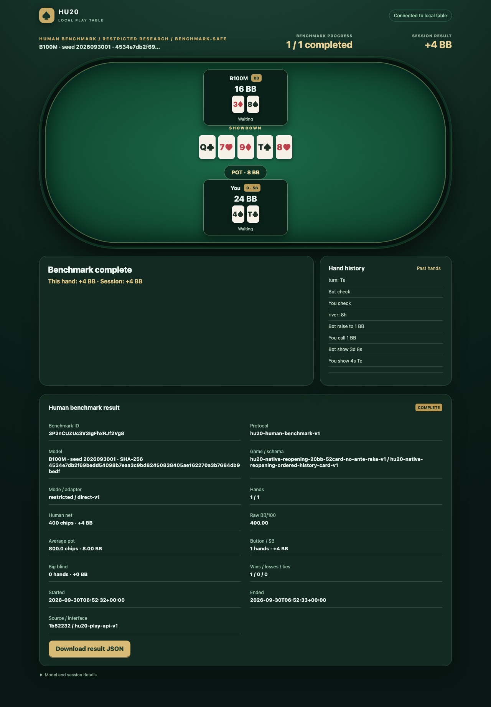
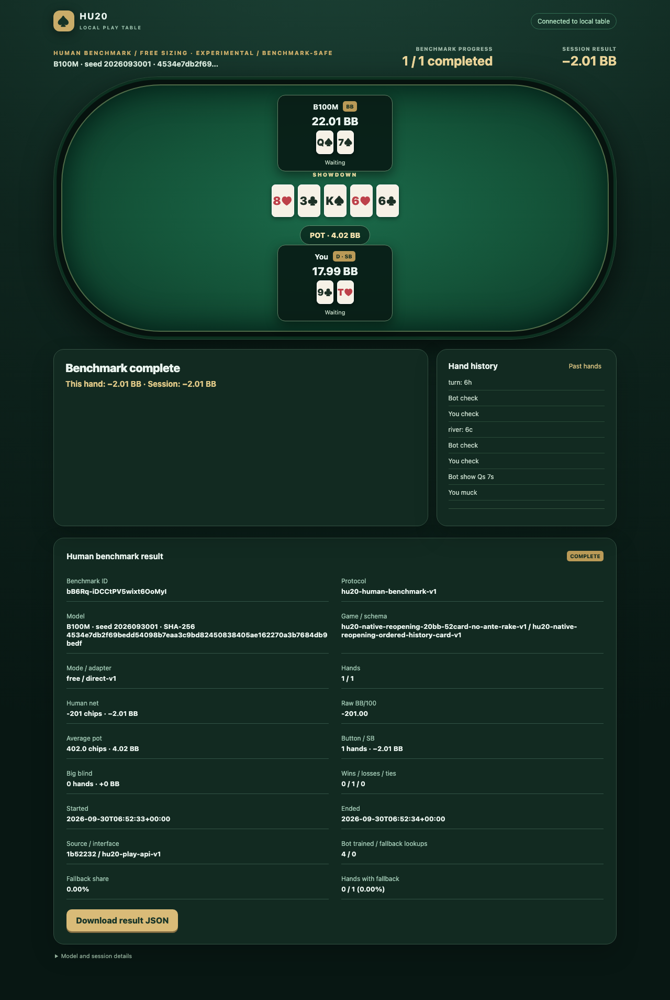

# HU20 human benchmark sessions

This protocol records a human playing the pinned B100M **heads-up 20BB** policy
through the [local web table](play-web.md). It measures raw human chip profit in
this game and play mode. It is not a professional-strength test, a six-player
result, or a v0.5 release decision. It does not use AIVAT or an action
translator.

## Start and resume

Start the loopback service and SSH tunnel as described in the [play guide](play-web.md#play-a-hand-step-by-step).
Enter the access token in the browser. On **New session**, choose **Human
benchmark**, then **Restricted research** or **Free sizing · experimental**.
Choose 50, 100, 200, 500, or a custom target from 1 to 5000 hands. No choice
is claimed to be statistically sufficient. Select **Create session** and
**Deal hand 1 / N**.

The server freezes the exact model SHA-256, HU20 game and schema, play mode,
direct adapter ID, target, alternating button schedule, benchmark visibility,
source/interface version, and protocol version `hu20-human-benchmark-v1`.
Seat 0 (the human) is button/small blind in the first hand, then positions
alternate. Each hand starts with 2000 chips per player and the native engine
settles it. An existing benchmark cannot change its target or play mode.

The table shows **Hand X / N** during play and the current hand's payoff after
settlement. The cumulative benchmark result is withheld until the benchmark
ends. Browser history also omits explicit per-hand payoffs while it is active.
This display reduces live result-based stopping cues; it cannot prevent a
player from tracking public actions and outcomes independently. Bot lookup and
fallback diagnostics are unavailable during the benchmark, including from the
developer endpoint. The server never chooses a human action on disconnect.

A browser refresh keeps the stored session ID. After a lost SSH connection,
reopen the tunnel and select **Reconnect / retry pending operation**. Mutation
idempotency keys and the private SQLite journal prevent duplicate deals,
actions, bot sampling, or completed-hand counting across a lost response or
service restart. If a benchmark is already open in another browser, use the
same browser profile and access token to resume it; creating a new browser
profile creates a different session.

## Finish or end early

The benchmark becomes **COMPLETE** in the same transaction that settles hand
N. A new hand N+1 is rejected. **End benchmark early** asks for confirmation
and sends an idempotent end request. It may be used between or during hands.
The server then marks the benchmark **ABORTED / INCOMPLETE**, retains every
completed hand and any unfinished current hand in the private journal, and
rejects further play. An aborted result is never labelled complete.

At either end, the results screen shows the benchmark ID, protocol and model
identity, planned/completed hands, raw net chips and BB, BB/100, button/small
blind and big blind hand counts and payoffs, wins/losses/ties, average terminal
pot, timestamps,
and source/interface version. Wins, losses and ties mean positive, negative
and zero **terminal human chip payoff**. For free sizing, the finished report
also shows trained/fallback bot lookup counts, fallback percentage and the
fraction of completed hands containing at least one fallback. The benchmark
diagnostics endpoint remains denied even after completion; only this
sanitized aggregate is available.

BB is 100 chips. `netBB = netChips / 100` and
`BB/100 = netBB * 100 / completedHands` when at least one hand is complete.
There is no interval, skill rating or probability claim. Both positions and
the total are computed from the authoritative replay records, with native
public-event digests checked. An empty aborted benchmark has no BB/100 value.

## Export and private replay

Select **Download result JSON** on the finished results screen. The browser
requests a server-generated JSON report using the access-token header. The
report contains aggregate numbers and references to completed private records
by opaque hand ID and public-event digest. It omits deal seeds, RNG state,
undealt or unrevealed cards, policy probabilities and raw lookup material.
The separate private `results/play-web/private.sqlite` journal remains on the
trusted host. The JSON report can also be fetched with an authenticated GET
to `/api/sessions/SESSION_ID/benchmark/export`; never put the access token in
the URL.

To verify completed hands from the private journal after stopping the service:

```sh
python -m tests.play_ui.verify_records results/play-web/private.sqlite
```

That replay is private and can include records from casual sessions too. The
focused generated-fixture checks are `python -m pytest -q
tests/play_ui/test_service.py`. The bounded M4 integration scripts are
`python -m tests.play_ui.benchmark_smoke --data-dir results/play-web-benchmark`
and `python -m tests.play_ui.benchmark_browser_smoke --data-dir
results/play-web-benchmark` with the B100M service on port 8767. The browser
script uses the isolated Chrome dependency described in the play guide. A real
B100M smoke should run only in a
coordinated M4 window, with the owned service stopped afterward. Such a smoke
checks integration, not human or bot playing strength.

## September 30, 2026 integration check

After Doctor Research released M4 for a bounded window, 13 focused
generated-fixture tests passed there; two later boundary cases brought the
final lightweight M1 focused suite to **15 passing tests**. One hash-verified B100M service process
ran a real HTTP benchmark smoke of two restricted and one free-sizing hand,
then a Chrome smoke of one hand in each mode. All **five** completed hands
replayed from the private journal with matching native public-event digests,
payoffs and chip conservation. Each free smoke sent a native-legal off-menu
raise-to of **201 chips**, and the private action record retained exactly 201.
The completed reports and JSON exports matched the server's replay-derived
numbers; the HTTP smoke rejected an N+1 deal.

The service used 1,916,336 KiB RSS after loading and 1,635,648 KiB at the
last live check. Swap remained 761.38 MiB. The owned service and browser were
stopped, and Doctor Research was notified. This small smoke checks the
interface and record path only; it says nothing about playing strength or the
precision of a future 200-hand result.
The smoke set the source-version field to the pre-smoke branch commit
`1b52232`; the later documentation, screenshot and narrow UI-label edits are
not reflected in that private test record.




