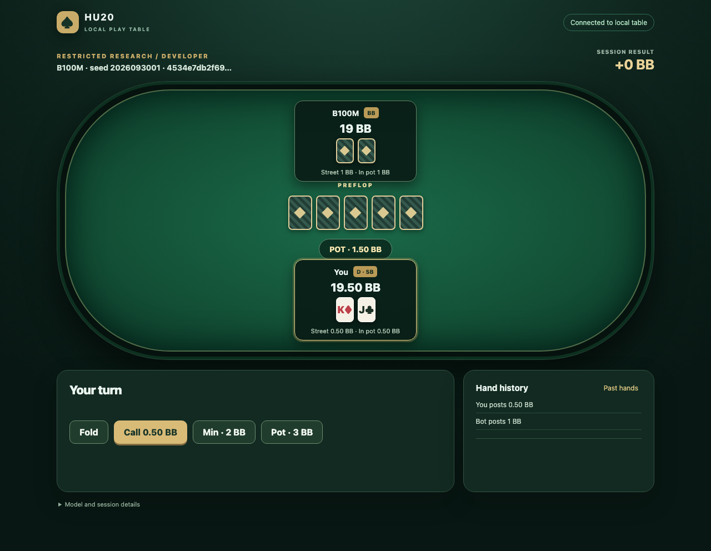
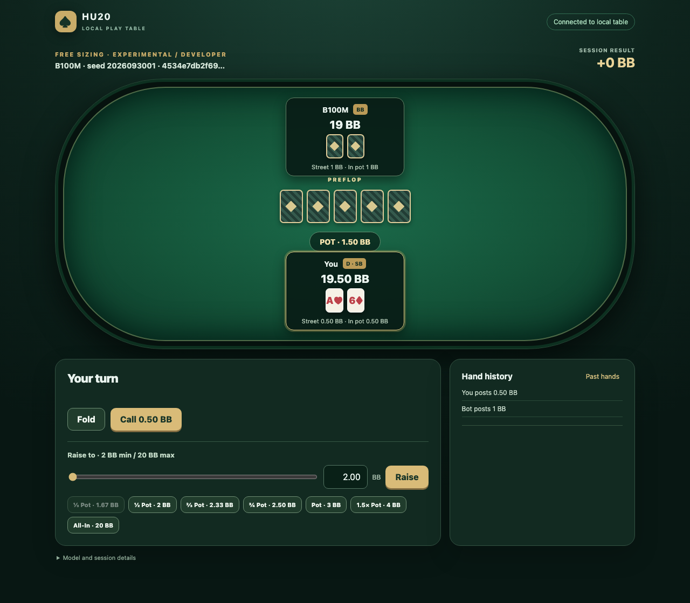

# Local HU20 web table

This is an experimental human-play interface for the fixed-first-seed B100M
native-reopening **heads-up 20BB** policy. It does not support six players,
100BB, tournaments, or a formal strength qualification. It uses the existing
native rules engine for every action and settlement. Stacks reset to 20BB each
hand; the button alternates; session BB is the sum of completed hand payoffs.

## Model and launch

The public `v0.4.0` release provides the unchanged fixed-first-seed inference
export as `B100M-HU20-current-seed-2026093001.json.gz`. Its sealed source is
`training/B-2026093001/current-100000000.json.gz` in the
[#116 recovery report](reports/hu20-scaling-m4-recovery.md#retained-artifacts-and-reproduction).
It is 40,144,034 bytes, SHA-256
`4534e7db2f69bedd54098b7eaa3c9bd82450838405ae162270a3b7684db9bedf`.
The service verifies that hash, HU20 game/schema, two-player format, uncapped
menu, and current extraction before accepting connections. The older B20M
model-card command is a different artifact.

Follow the [clean source-install and verified download](../readme.md#quick-start)
first. The release download is available after publication; release-candidate
reviewers can use the sealed artifact with the same size and hash. From the
checkout with dependencies installed and verified model bytes:

```sh
python -m src.play_api.server \
  --policy models/B100M-HU20-current-seed-2026093001.json.gz \
  --data-dir results/play-web \
  --source-version "$(git rev-parse HEAD)"
```

The service binds **only to `127.0.0.1:8765`**. Open
`http://127.0.0.1:8765/`. Read the access token from the private
`results/play-web/access.token` file and enter it into the UI. The token is
never placed in a URL, HTTP log, or play record. The token and private SQLite
database are mode `0600`; their directory is mode `0700`. Keep this server on
a trusted machine and do not expose it publicly or bind it to all interfaces.

To reach an M4-hosted service from another machine, establish an SSH tunnel:

```sh
ssh -N -L 8765:127.0.0.1:8765 user@your-trusted-host
```

Use a trusted SSH host on which you launched the loopback service. Never
forward the service to a public interface.

The service survives tunnel loss. Reconnect the tunnel, reopen the browser,
and use **Reconnect / retry pending operation** if needed. The browser stores
the session ID and access token locally; it never generates a new session on
refresh. A pending mutation retains its idempotency key, so retrying a lost
response cannot deal or act twice. No human action is chosen on disconnect.

## Play a hand: step by step

1. On the trusted machine, activate the checkout's Python environment
   (`. .venv/bin/activate`), verify the downloaded model bytes and run the
   service command in **Model and launch**. Keep that terminal running while
   playing. The service prints its local address and the token-file location;
   it does not print the token.
2. Read `results/play-web/access.token` on the trusted machine. Treat it as a local password:
   enter it only into the table's **Access token** field, and do not put it in
   a URL, shell command argument, shared chat, or screenshot.
3. If the browser is on a different computer, open a **second terminal** and
   run the SSH tunnel command above. Leave the tunnel open. Visit
   `http://127.0.0.1:8765/` in the browser and select **Unlock table** after
   entering the token. A browser on the service machine needs no tunnel.
4. Choose **Restricted research** for the policy's trained action menu or
   **Free sizing · experimental** for any native-legal raise size. Choose
   **Casual / developer** to see post-hand lookup counts or **Benchmark-safe**
   to keep those diagnostics unavailable. Select **Create session**, then
   **Deal next hand**. Mode and visibility stay fixed for that session.
5. When **Your turn** appears, use the displayed action buttons. In restricted
   mode, each allowed concrete action has its own button. In free mode, use
   Fold, Check, or Call, or set a raise-to amount with the slider, an exact BB
   value, or a pot-size preset, then select **Raise**. The input is the *total
   wager on this street*, not an additional amount. For example, `2.01` BB
   submits exactly 201 chips. The displayed minimum and maximum come from the
   native engine. The bot acts after your submitted action; no network error
   causes an automatic human move.
6. At **Hand complete**, read **This hand** and **Session result**, review the
   action log, and select **Deal next hand** to continue. **Past hands** opens
   sanitized completed-hand histories. **Model and session details** shows
   the full pinned SHA-256 and the session ID needed for replay.

Reloading the page resumes the same session. If the SSH connection drops,
reopen the tunnel and use **Reconnect / retry pending operation**; a retry of
an acknowledged action cannot apply it twice. To try the other mode, open a
separate private browser window and create a new session there. Stop the
service with Ctrl-C when finished; the private journal remains in
`results/play-web/` for later replay. Stop the SSH tunnel separately.

## Modes and controls

- **Restricted research:** concrete actions from the native-reopening model
  menu only. This is the supported restricted game.
- **Free sizing · experimental:** any native-legal integer-chip raise. The
  engine executes the displayed exact raise-to amount. Off-menu histories may
  use the current policy's uniform missing-key fallback; no translator runs.
- **Benchmark-safe visibility:** fixes the model and hides lookup diagnostics
  on the server for the whole session. It does not itself define a formal
  statistical human benchmark. Casual/developer sessions show trained/fallback
  counts only after a completed hand.

The free-sizing slider moves in one-chip steps. The exact BB input permits at
most two decimal places because 100 chips equal 1BB. Entering a number outside
the server's legal raise-to bounds fails without rounding or clamping. Pot
fraction presets are calculated on the server from its current observation;
they show the exact chip target before submission.

## Records and replay

`results/play-web/private.sqlite` is a **private** journal. It retains deal
seeds and RNG states to reconstruct hands and future bot sampling after a
restart. Those fields never appear in browser responses or the browser's
sanitized history endpoint. A completed record includes exact actions and
legal bounds, bot trained/fallback telemetry, source/model identity, terminal
payoff, and the digest of native public events. The browser sees only its own
cards, the board, public actions, and bot cards legitimately shown by native
disclosure rules. Folded or mucked bot cards remain hidden.

After stopping the live service, verify all completed hands in a session with:

```sh
python -m src.play_api.server --policy models/B100M-HU20-current-seed-2026093001.json.gz \
  --data-dir results/play-web --verify-session SESSION_ID
```

`SESSION_ID` is shown in the browser's session details. This replays each
hand through `Hand.start` and `Hand.apply` and checks the public-event digest
and terminal chip result. The private database must remain on the trusted
host. Back it up before removing it.

## Validation evidence

The focused `test_service.py` checks use a generated, in-memory menu policy
fixture, not the B100M artifact. Run them with
`python -m pytest -q tests/play_ui/test_service.py`. The real-model acceptance smoke must be run separately
on M4 during a confirmed compute window. It checks both sizing modes, one
native-legal off-menu wager, replay, the model hash, and post-hand disclosure.
That smoke verifies integration and usability, not playing strength. Record
its command, screenshot, memory footprint, and result in the draft PR; stop
the owned service after the smoke.

With the B100M service already running on port 8767, the bounded acceptance
commands are `python -m tests.play_ui.real_smoke --base
http://127.0.0.1:8767 --data-dir results/play-web` and `python -m
tests.play_ui.browser_smoke`. The browser smoke needs Chrome and an isolated
`websocket-client` installation under `results/browser-deps`. To replay all
private records without loading the policy, stop the service and run
`python -m tests.play_ui.verify_records results/play-web/private.sqlite`.

### September 30, 2026 integration smoke

In the owner-approved M4 window, the service loaded the documented B100M export
once and used about **1.92 GiB RSS**. The isolated test copy passed **1,115
tests, 26 skipped, and 21 subtests**. A real HTTP smoke and headless Chrome
smoke each completed one hand in both modes. The free HTTP smoke submitted a
native-legal **201-chip raise-to**, absent from the restricted menu; the
private action record contains exactly 201. All six completed hands in that
isolated database replayed through the native engine with matching public-event
digests, terminal payoffs, and conserved chips. Three free hands included an
off-menu raise. The browser screenshots capture the first human decision:





The test server and headless browser were stopped after validation. This was
an integration smoke using an rsynced isolated working copy based on main
`2fd442be79f18b7498d79ca4f5cbaf2978bafb9d`; the record's source-version
field names that base revision, not a final PR commit. These hands are not a
research or strength dataset.
