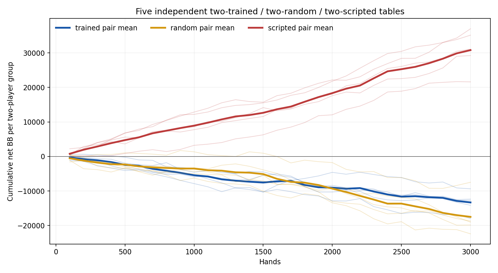
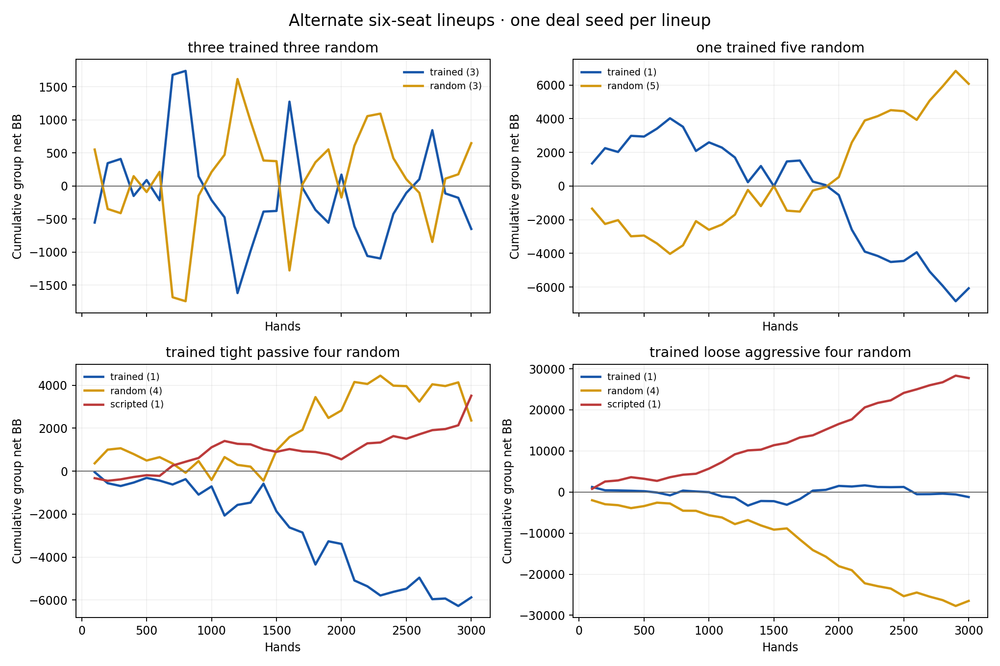

# Checkpoint 0.4: six-player blueprint campaign

## Result

The chosen checkpoint has **58,015,659 entries** at iteration 99,646 (SHA-256 `1b7d9ef0a6f111ac82d99f802cf7ac7bc5c8685ff6a2f214cb918f7ef9361bc2`). The one-time fresh random-opponent test earned **+104.99 BB/100**, 95% CI **[+27.18, +182.79]**, over 24,576 candidate hands. It beat the uniform blueprint control by **+117.45 BB/100 paired**, 95% CI **[+71.42, +163.49]**. All 49,152 candidate and control hands were valid; no illegal actions occurred. This meets the campaign's narrow fresh random-profit check. It does not qualify v0.5: validation against the scripted pool remains deeply negative.

The owner requested an extra evaluation after many hours without a measured checkpoint. The trainer received SIGINT at 2026-09-25 06:25 UTC, completed its in-progress recovery save, wrote a measured snapshot at 58.02 million entries, evaluated it, and exited cleanly with `stop_reason=signal`. After reviewing those validation results, the owner chose this as the final checkpoint instead of spending the roughly seven remaining hours of the planned 24-hour training segment. The learning recipe, seed, action abstraction, and evaluation schedules did not change. The stop and final-checkpoint choice were informed by validation, so the repeated validation series is exploratory; the sealed test was opened once only after the choice.

## Training and validation

The run resumed seed `2026092402` from the 5,834,622-entry source checkpoint on commit `a7e01a7`. The pod provided eight vCPUs of **AMD EPYC 9655**, with a cgroup memory limit of **64,000,000,000 bytes** and a 50-GB container disk. The declared limits were one worker, 24 hours, 50 GiB conservative parent-plus-worker RSS, and 10 GiB free disk. The run consumed 17.10 hours through the final save, traversed **584,137,233 nodes** including the source work, and peaked at **36.78 GiB conservative RSS** during training. The final compressed checkpoint is **2,493,008,936 bytes**; its save took **741.9 seconds**. Reloading it for the sealed test reached approximately **45.6 GiB process RSS**, an important higher memory figure for future inference runs. No OOM or disk guard fired.

The same pod then ran the sealed test, cash tables and paired search comparison. RunPod showed a balance decrease from **$17.81 to $9.70**, approximately **$8.11** for the combined rental including disk. The pod was stopped after all four artifact sets were hash-verified on the M4. Its RunPod details show **$0.00/hour** for both compute and storage; no billable pod work remains.

| Entries | Iteration | Random BB/100 | Scripted BB/100 | Preflop trained | Flop trained |
| ---: | ---: | ---: | ---: | ---: | ---: |
| 5.83m source | 8,733 | +221.53 | −466.65 | 26.9% | 4.5% |
| 6.00m | 8,988 | +220.72 | −466.20 | 27.0% | 4.7% |
| 12.00m | 18,455 | +242.32 | −467.38 | 28.0% | 5.8% |
| 24.00m | 38,081 | +263.37 | −432.39 | 29.1% | 7.1% |
| 36.00m | 58,500 | +256.77 | −439.21 | 29.4% | 7.3% |
| **58.02m** | **99,646** | **+297.90** | **−432.32** | **29.8%** | **7.8%** |

Each random validation point used the same 1,024 paired blocks; each scripted point used the same 512 paired blocks. At 58.02m, random candidate CI was **[+138.00, +457.80]** and paired improvement over uniform was **+145.14 [ +45.29, +244.99 ] BB/100**. Scripted candidate CI was **[−553.04, −311.60]**; paired improvement over uniform was **+29.59 [−29.46, +88.65]**, inconclusive. The random series rises broadly, while scripted play remains weak. These intervals are for each checkpoint's result, not for the change between checkpoints. The fresh random estimate is lower than reused validation but its interval overlaps; it still clears zero. On fresh test decisions, trained lookup covered 29.8% of preflop and 9.0% of flop actions, leaving most postflop choices at the uniform fallback.

## Exploratory cash tables

Nine separate six-seat tables each played 3,000 hands with 100 BB reset stacks, one-seat button rotation, independent deal seeds, and a zero-sum ledger checked after every hand. All copies of the trained player used the same frozen checkpoint with independent action RNGs. The first five runs placed two trained, two random, one tight-passive and one loose-aggressive player at the table. Four more runs varied the lineup. Balances are cumulative **group** net BB, so group sizes differ across alternate lineups. [Every seat's balance every 100 hands](data/blueprint-04-showcase-balances.csv) and the retained JSON permit finer inspection.

| Lineup and seed | Trained group | Random group | Scripted group |
| --- | ---: | ---: | ---: |
| Two each · 2026092411 | −12,731.50 | −22,401.50 | +35,133.00 |
| Two each · 2026092412 | −17,955.55 | −19,024.79 | +36,980.34 |
| Two each · 2026092413 | −12,352.41 | −18,709.92 | +31,062.33 |
| Two each · 2026092414 | −9,367.05 | −19,852.76 | +29,219.81 |
| Two each · 2026092415 | −14,135.83 | −7,473.76 | +21,609.59 |
| Three trained, three random · 2026092416 | −648.30 | +648.30 | — |
| One trained, five random · 2026092417 | −6,072.44 | +6,072.44 | — |
| One trained, tight-passive, four random · 2026092418 | −5,873.08 | +2,359.83 | +3,513.25 |
| One trained, loose-aggressive, four random · 2026092419 | −1,224.63 | −26,503.98 | +27,728.61 |

The repeated mixed tables agree that the scripted players extract substantial cash from both trained and random seats in this setting. The alternate one-seed lineups are volatile, including a losing one-trained/five-random run despite the positive 24,576-hand sealed random test. These cash paths are descriptive and were selected after the initial campaign design; they are not an independent strength gate or a tournament with eliminations.

## Artifacts and next experiment

The checkpoint and snapshot were copied to the M4, each independently SHA-256 verified. The one-time test result was copied with SHA-256 `daa01cb89b690ef2e6731920d75c06ed21eb600e1c624e052225431ad9a2985e`. The nine-table showcase archive was copied with SHA-256 `e497de16c40b86cdf6a1970dcfd5ba09d249968d3484020b347be399678ac4c1`. All are under `~/Local/blueprint-04-backups` on the M4; the large training checkpoint is stored by its content hash in `checkpoints/` and `snapshots/` rather than in Git. The final checkpoint's paired [postflop search comparison](https://github.com/dberweger2017/deepcfr-texas-no-limit-holdem-6-players/pull/103) improved profit by +245.64 BB/100 against random and +236.34 BB/100 against scripted opponents, both with positive paired 95% intervals. Search uses the fixed checkpoint; it does not retrain this seed. The search archive is also verified on the M4 (SHA-256 `7bd8e51151f57e9c4cac72d62c6422540a51607904ce6c5852d0c253720e14ab`).
