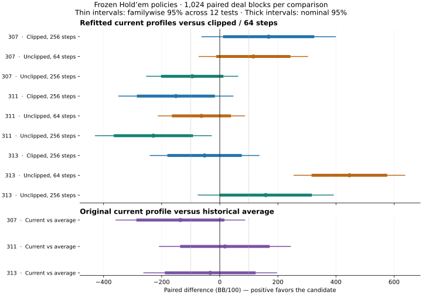

# Frozen Hold'em policies: decisions and playing results

**The refits change decisions substantially, but no fitting change improves play consistently across seeds. Current-policy play does not reveal a hidden strong learner behind the historical average.**

All three seeds and all twelve comparisons completed. This is an evaluation of saved
iteration-256 policies, not a new training campaign. No production defaults or
historical snapshot archives changed, and no model is promoted. The
[complete compact report](holdem-policy-comparison.json) retains every role,
street, policy and comparison.

## Protocol

The [protocol](../holdem-policy-comparison.md) and
[plan](../../configs/holdem/policy-comparison.json) were frozen before launch at
`f4cfd80a22cc45ef09d7383839a10f0ca8561f8d`. Seeds 307, 311 and 313 use their original iteration-256 checkpoints and
all 72 hash-pinned role weights from the completed fitting study. Width, training
targets, observations, legal actions and opponents are unchanged.

Replay diagnostics cover every retained record using actual regret matching.
The arena uses 1,024 fresh validation deal blocks (root 120913), all six seat
rotations and the five-style pool, with the same blocks across comparisons and
training seeds. Each comparison plays 12,288 hands across candidate/control arms.
The total **147,456 scheduled hands** includes repeated controls and correlated
rotations; it is not that many independent deals. Every hand completed, with zero
invalid actions, accounting failures or retries.

## Did fitting change the policies?

Total variation (TV) is half the sum of absolute action-probability differences
from clipped/64. It ranges from zero for identical distributions to one for
completely disjoint distributions. It measures change, not improvement.

The table weights retained replay records uniformly, rather than weighting by
importance corrections or treating them as unique information sets. The replay is
in-sample and potentially correlated; its composition is not the policy's play
frequency. `Fallback` means all predicted regrets are nonpositive, when the
production policy chooses its largest-regret action.

| Seed | Policy | Mean TV | TV > 0.10 | Fallback | Entropy (nats) |
| --- | --- | ---: | ---: | ---: | ---: |
| 307 | clip64 | 0.0000 | 0.00% | 50.85% | 0.0915 |
| 307 | clip256 | 0.4609 | 65.65% | 44.56% | 0.3224 |
| 307 | unclipped64 | 0.2751 | 50.87% | 49.87% | 0.3290 |
| 307 | unclipped256 | 0.2470 | 40.97% | 33.96% | 0.1778 |
| 307 | current | 0.0000 | 0.00% | 50.85% | 0.0915 |
| 311 | clip64 | 0.0000 | 0.00% | 10.76% | 0.6360 |
| 311 | clip256 | 0.3306 | 66.96% | 43.99% | 0.2432 |
| 311 | unclipped64 | 0.1783 | 48.62% | 0.29% | 0.4313 |
| 311 | unclipped256 | 0.3318 | 74.84% | 29.57% | 0.2488 |
| 311 | current | 0.0000 | 0.00% | 10.76% | 0.6360 |
| 313 | clip64 | 0.0000 | 0.00% | 44.47% | 0.2554 |
| 313 | clip256 | 0.3018 | 57.92% | 18.86% | 0.4009 |
| 313 | unclipped64 | 0.1963 | 21.76% | 52.69% | 0.2470 |
| 313 | unclipped256 | 0.4444 | 71.28% | 46.59% | 0.3914 |
| 313 | current | 0.0000 | 0.00% | 44.47% | 0.2554 |

Original `current` is included to measure any decision-level consequence of the
small cross-platform parameter differences in the clipped/64 refit control. It is
not a fifth fitting treatment. Per-role results, TV > 0.05 and action-kind masses
for all five policies are in the JSON report. No target argmax is used as truth.

### Replay coverage

Counts are shared by all policy arms. A missing street has no observations, not a
measured zero effect.

| Seed | Preflop | Flop | Turn | River | Preflop share |
| --- | ---: | ---: | ---: | ---: | ---: |
| 307 | 24,032 | 492 | 44 | 8 | 97.79% |
| 311 | 23,719 | 760 | 90 | 7 | 96.51% |
| 313 | 23,538 | 871 | 146 | 21 | 95.78% |

### Unclipped/256 by street

Action mass groups all raise sizes together. TV still distinguishes individual
sizes. Sparse late-street rows are descriptive observations, not stable estimates
of all postflop behavior. Control and other-arm street summaries are retained in
the JSON report.

| Seed | Street | Records | Mean TV | Fold | Check | Call | Raise |
| --- | --- | ---: | ---: | ---: | ---: | ---: | ---: |
| 307 | preflop | 24,032 | 0.2445 | 4.9% | 0.0% | 77.8% | 17.3% |
| 307 | flop | 492 | 0.3488 | 5.9% | 1.2% | 42.4% | 50.5% |
| 307 | turn | 44 | 0.4063 | 2.1% | 0.7% | 24.5% | 72.7% |
| 307 | river | 8 | 0.4921 | 1.3% | 0.0% | 1.8% | 96.8% |
| 311 | preflop | 23,719 | 0.3281 | 3.9% | 0.0% | 77.9% | 18.2% |
| 311 | flop | 760 | 0.4350 | 6.5% | 1.5% | 38.1% | 53.9% |
| 311 | turn | 90 | 0.4322 | 7.7% | 4.1% | 36.2% | 52.0% |
| 311 | river | 7 | 0.3089 | 6.0% | 5.9% | 14.3% | 73.7% |
| 313 | preflop | 23,538 | 0.4451 | 45.7% | 0.0% | 47.5% | 6.8% |
| 313 | flop | 871 | 0.4438 | 26.9% | 18.9% | 28.4% | 25.7% |
| 313 | turn | 146 | 0.3701 | 23.6% | 17.3% | 29.6% | 29.5% |
| 313 | river | 21 | 0.2402 | 10.6% | 34.4% | 23.8% | 31.3% |

## Paired poker results

All values are BB/100. The table uses the predeclared **familywise 95% intervals**
(Bonferroni across twelve comparisons), over paired deal-block means. Nominal 95%
intervals and both absolute-rate intervals are in the JSON report. Shared deals
and correlated roles are not independent training replications.

| Seed | Candidate / control | Candidate | Control | Difference | Familywise interval |
| --- | --- | ---: | ---: | ---: | --- |
| 307 | clip256-vs-clip64 | -925.88 | -1094.06 | +168.18 | [-61.65, 398.01] |
| 307 | unclipped64-vs-clip64 | -978.39 | -1094.06 | +115.67 | [-71.07, 302.42] |
| 307 | unclipped256-vs-clip64 | -1188.96 | -1094.06 | -94.91 | [-251.99, 62.18] |
| 307 | current-vs-average | -1094.06 | -958.35 | -135.71 | [-357.41, 85.99] |
| 311 | clip256-vs-clip64 | -1152.94 | -1001.90 | -151.03 | [-347.54, 45.47] |
| 311 | unclipped64-vs-clip64 | -1065.16 | -1001.90 | -63.26 | [-211.88, 85.36] |
| 311 | unclipped256-vs-clip64 | -1230.49 | -1001.90 | -228.59 | [-428.25, -28.93] |
| 311 | current-vs-average | -1001.90 | -1019.60 | +17.69 | [-207.80, 243.18] |
| 313 | clip256-vs-clip64 | -1038.45 | -986.15 | -52.30 | [-239.54, 134.94] |
| 313 | unclipped64-vs-clip64 | -539.93 | -986.15 | +446.22 | [255.62, 636.83] |
| 313 | unclipped256-vs-clip64 | -827.88 | -986.15 | +158.27 | [-74.24, 390.78] |
| 313 | current-vs-average | -986.15 | -953.28 | -32.87 | [-261.43, 195.69] |

The primary unclipped/256 comparison changes results by **−94.91, −228.59 and
+158.27 BB/100** for seeds 307, 311 and 313. Seed 311 is a regression even under
the familywise interval. The predeclared condition for prioritizing this recipe
for online confirmation fails: neither the signs nor the adjusted intervals
support a consistent improvement.

There is also a real positive result worth retaining: unclipped/64 improves seed
313 by **+446.22 BB/100**, with a familywise interval **[255.62, 636.83]**, clearing
the coarse material margin. Its other seeds do not establish the same effect.
This is evidence that fitting changes can matter strategically, not a reason to
select that seed or adopt the recipe generally. Of twelve comparisons, one has a
positive difference and one a negative difference after the familywise correction;
ten remain inconclusive. None
establishes equivalence inside the ±100 BB/100 margin.

Current versus average differences are **−135.71, +17.69 and −32.87 BB/100**;
all three adjusted intervals include zero. This does not prove they are equivalent
or certify the averaging implementation, but gives no support for replacing the
historical average with a consistently stronger current model. All evaluated
current/refit/average point estimates remain negative against this style pool;
even the best is about **−540 BB/100**.

The behavioral effects are much larger than the small MSE percentages suggested:
refit mean TV ranges from **0.178 to 0.461** across seed/arm combinations. Depending
on the arm and seed, **21.8–74.8%** of replay records have TV above 0.10. Original
current versus clipped/64 control TV is below **7e-8** on average for every seed,
and their arena rates match. Control reconstruction error is not an apparent
explanation for the large treatment differences.

Dotted lines mark the predeclared ±100 BB/100 diagnostic margin.

The predeclared material-effect margin is ±100 BB/100, a coarse diagnostic margin,
not a competitive-poker standard. Inconclusive does not mean equivalent. An
interval wholly inside that margin supports similarity only at that resolution.
No result here is a professional-strength claim or independent final-test pass.

## Resources and verification

One local CPU process and one Torch thread per seed, run sequentially. Limits were
15 minutes per seed and 45 minutes total. All seeds, roles and planned comparisons
are retained; none was selected or extended based on outcomes.

| Seed | Load seconds | Total seconds | Peak process RSS (GiB) |
| --- | ---: | ---: | ---: |
| 307 | 99.11 | 292.43 | 2.558 |
| 311 | 108.08 | 282.49 | 2.836 |
| 313 | 108.11 | 343.28 | 2.482 |

Total elapsed time: **928.25 seconds (15.47 minutes)**. Rental cost: **$0**.

All input checkpoints and fitted weight files passed their pinned hashes. The
same immutable current profiles were checked after evaluation; the historical
archive identity was preserved. Independent post-run verification reread every
compressed hand outcome, checked its digest and zero-sum settlement, reconciled all
147,456 scheduled hand keys, and recomputed all twelve paired familywise intervals.
The three repeated clipped/64 controls produced identical outcome sequences for
each seed. Every comparison used the same block schedule digest.

Focused validation before launch passed 27 tests covering policy scaling/signs,
fallback, street denominators, current versus one-component average action-stream
equivalence, public-only observations, deterministic outcomes, failure retention,
weight hashes and interval mathematics. The full 585-test CI suite and end-to-end checks passed for the executed implementation.

## Artifacts and next decision

Local artifacts are retained in `results/policy-comparison/`: the source/environment
manifest and supervisor result, seed logs and reports, and each comparison's
schedule, report and `outcomes.jsonl.gz`. File hashes and policy fingerprints are
in the compact JSON report. These are local files, not public model downloads.
Inputs remain in `results/frozen-fitting/`; the original longer-run archive is
intact. Reproduce with the committed command and pinned fitting report.

Keep the current production fitting recipe and historical average. End this
optimizer sweep: neither unclipped/256 nor the other refits earns a consistent
playing-strength claim. The evidence supports prioritizing the quality and
coverage of training targets, while leaving representation and fitting as possible
contributors; it does not identify one proven root cause.

The next development task is a **separate persistent value-baseline prototype**
with its own replay/training state, followed by a fixed-work comparison of target
variance, per-street coverage and cost before another longer multi-seed campaign.
Keep the regret learner and playing-agent information boundary unchanged for that
comparison. Define the critic's inputs, targets, update timing and recovery state
explicitly before implementation; persistence alone is not a complete algorithm.

This is a research direction, not a claim that a particular paper can be dropped
into our trainer. [DREAM, section 5.2](https://arxiv.org/html/2006.10410) uses a
separate Q baseline carried across iterations, with its own circular buffer and
expected-SARSA targets. Its critic uses the players' combined information states,
so its inputs and targets differ from our current own-observation value head.
The paper motivates the prototype, but does not establish success for our
six-player setup.

Replay contains **95.8–97.8% preflop records** and only **7–21 river records per
seed** at this checkpoint. That is a concrete coverage limitation to track in the
next experiment, not permission to reweight streets arbitrarily or treat noisy
sample targets as exact values. If a persistent baseline fails to improve measured
variance at comparable cost, the next alternative is controlled additional
traverser branching, not another unbounded learning-rate or clipping sweep.
