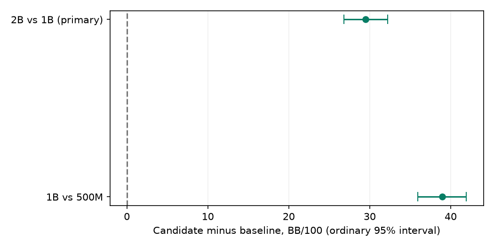

# HU100 preventive stop at 2B and direct ladder

The terminal passes the predeclared improvement criterion: terminal 2,000,000,460 nodes versus 1B is **+29.51 [+26.82, +32.20] BB/100** over 524,288 independent duplicate blocks. Actual half-width is 2.69 BB/100; improvement requires the ordinary 95% lower bound above 0.

This single fixed training seed extends #207’s unchanged recipe and does not establish multi-seed strength, a default change or a release. The [prospective protocol](../hu100-3b-ladder.md) fixes the decision, seeds, guards and sample selection.

## Fresh training and exactness

Fresh seed 2026100601, 100 BB, roots-per-seat 1, opponent-sampled average, unchanged v1/menu. First segment through 1B retains #207’s 57,658,644 entry cap so the checkpoint header matches; later segments use 67,419,934. Continuations load only this campaign’s newly generated state, never an archived checkpoint.

| Requested nodes | Actual nodes | Entries | Checkpoint SHA256 | Gate |
| ---: | ---: | ---: | --- | --- |
| 500000000 | 500,000,323 | 30,027,422 | `35f4b46e6c490573b2cf3ebe4953c269a7793845f425dd53e296fc64be439788` | #207 byte-exact |
| 1000000000 | 1,000,002,065 | 41,010,014 | `cca0b54a609f47c60b29e9fe5a920475a91ec641df2ff0e3ea48fdac615147ec` | #207 byte-exact |
| 2000000000 | 2,000,000,460 | 54,626,283 | `e84039c7a934a966a2c01f237748a23951124a8b665edc2585ef4809e5681676` | fully audited |

Every evaluated checkpoint was stream-exported as current/average and fully audited. Both fresh 500M and 1B checkpoint and average hashes equal the indexed #207 outputs; exact indexed originals are archive dependencies, so the ZIP omits duplicate model bytes. Training telemetry and complete export/audit records are retained. The predeclared terminal-versus-1B rule determines the primary endpoint.

## Preventive disk-admission stop at 2B

The 3B segment never started. Measured 2B export peak working-space consumption was 13.58 GiB. Scaling that workspace and checkpoint bytes to the predeclared 67,419,934 entry ceiling required 19.59 GiB; only 13.89 GiB would remain, below the unchanged 16 GiB floor. The initial final-originals/ZIP reserve omitted this temporary export peak. No actual guard breach occurred.

Only the orchestration parent was paused while the guarded 2B full audit finished. After independent source clearance and successful audit/child cleanup, that paused parent was retired administratively; previously unstarted spec/pairs and the unchanged timing/freeze/quote/final workflow ran once. The native 2B gate retains terminal_capacity_stop=false: this is a preventive disk-admission stop, distinct from a native entry-cap stop. The existing terminal-versus-1B rule uses 2,000,000,460 nodes; no 3B model, interrupted scientific operation or scientific retry exists. The 2B-versus-1B comparison is the primary, so it is not repeated as a descriptive rung.

## Direct duplicate matches

Both policies reset to 100 BB each hand, 50/100 blinds, no rake; each deal plays twice with seats swapped. Private policy streams and menu-only actions; translation off. Fresh physical schedules are checked against all 18 prior frozen HU100 arena roots. Every final hand, action/key/probability/menu and settlement is replayed and independently reproduced.

| Rung | BB/100 [ordinary 95%] | Half-width | Blocks | Three-rung Bonferroni interval |
| --- | ---: | ---: | ---: | ---: |
| terminal-vs-1b | +29.51 [+26.82, +32.20] | 2.69 | 524,288 | [+26.23, +32.80] |
| 1b-vs-500m | +38.93 [+35.92, +41.95] | 3.01 | 524,288 | [+35.25, +42.61] |

Only terminal-versus-1B decides. The other rung is descriptive. The conservative three-comparison Bonferroni interval is retained even though the 2B terminal leaves only two distinct comparisons. No result changed samples, checkpoints or scope.

Dropped descriptive rungs by prospective time/storage admission: none. Frozen sample 524,288 blocks/rung; projected half-width 4.51 BB/100 used only the historical planning SD, never pilot winnings/variance.

## Scripted secondary and coverage

Both endpoints played all five scripted opponents with exact 512-state/128-event translation, 4,096 paired duplicate blocks/opponent. Every final hand replayed/reproduced. The contrasts are descriptive and do not add a pass opportunity.

| Opponent | Terminal BB/100 [95%] | 1B BB/100 [95%] | Terminal minus 1B [95%] |
| --- | ---: | ---: | ---: |
| check_call | +132.12 [+110.96, +153.29] | +115.50 [+94.68, +136.31] | +16.63 [-0.19, +33.44] |
| loose_aggressive | +42.18 [+7.36, +77.00] | +40.02 [+3.61, +76.43] | +2.16 [-31.28, +35.60] |
| pot_pressure | -37.09 [-69.66, -4.52] | -45.09 [-77.55, -12.64] | +8.00 [-20.21, +36.22] |
| random | +106.90 [+33.81, +179.98] | +125.48 [+52.92, +198.04] | -18.59 [-50.30, +13.13] |
| tight_aggressive | +54.87 [+35.47, +74.27] | +46.50 [+25.98, +67.02] | +8.37 [-8.66, +25.40] |

Exact-key coverage across the five opponents (decision-weighted):

| Policy | Street | Decisions | Positive mass | Zero mass | Missing |
| --- | --- | ---: | ---: | ---: | ---: |
| 1b | flop | 17,351 | 93.29% | 0.00% | 6.71% |
| 1b | preflop | 33,625 | 94.57% | 0.00% | 5.43% |
| 1b | river | 10,411 | 95.42% | 0.00% | 4.58% |
| 1b | turn | 12,915 | 94.15% | 0.00% | 5.85% |
| terminal | flop | 18,000 | 92.98% | 0.00% | 7.02% |
| terminal | preflop | 33,676 | 94.49% | 0.00% | 5.51% |
| terminal | river | 10,980 | 94.95% | 0.01% | 5.04% |
| terminal | turn | 13,462 | 93.67% | 0.00% | 6.33% |

Reached-key traverser visit counts across opponents and streets:

| Policy | Key | Missing | 0 | 1–9 | 10–99 | 100+ |
| --- | --- | ---: | ---: | ---: | ---: | ---: |
| 1b | exact | 4,224 | 17 | 171 | 1,221 | 68,669 |
| 1b | selected | 2,549 | 18 | 173 | 1,294 | 70,268 |
| terminal | exact | 4,525 | 5 | 100 | 685 | 70,803 |
| terminal | selected | 2,602 | 6 | 101 | 711 | 72,698 |

Absolute results, coverage and exact/translated-key visit bands are retained in [secondary-summary.json](hu100-3b-ladder-artifacts/secondary-summary.json).

Direct coverage and visit bands by policy/street are retained in [summary.json](hu100-3b-ladder-artifacts/summary.json). Missing/zero mass uses uniform fallback; coverage and visit counts are descriptive.

## Measured budget and preservation

Fresh 1M timing pilot measured 3,144,671 nodes/s. The posted train/save/export/audit quote was 6.47h, including 2× measured headroom. The resume-loading allowance used historical full-audit duration as a conservative proxy; it was not a measurement of native checkpoint loading. Actual completed operation durations determine the final scope admission. Direct timing pilot included full loading, play, replay and reproduction; frozen direct quote 5.11h, secondary quote 0.59h, A completed partial cost 1.82h. Full prospective scope quote 9.93h. The full scope remained below the ten-hour threshold, so the scripted secondary was admitted.

Whole-family 7/9 GiB, total 3 GB swap, normal pressure/15% system free, 16 GiB disk and AC guards were unchanged. The opt-in checked-sorted loader shares compact buffers and validates ordering, avoiding global sorting copies; default inference is unchanged. No trainer source edit, failed-science retry, leak, invalid action, accounting error, release, tag, publication, paid compute or other-PR cleanup occurred. Complete guard samples, pilots, models and traces are in the member-hashed ZIP; upload acceptance/restoration is indexed in [RESULTS_INDEX](../../RESULTS_INDEX.md). Originals remain retained.

Actual guarded B operations total 3.90 h, including training, exports, full audits and pilots; final direct play/replay/reproduction took 1.76 h and the final scripted secondary 13.13 min. All 70,225 retained resource samples passed: peak family RSS 6.08 GiB, maximum total swap 1.05 GB, minimum system free 75%, minimum disk free 26.12 GiB.

## Validation and independent evidence review

The single combined [end evidence review](hu100-3b-ladder-artifacts/evidence-review.json) is clear, with no correctness findings open. It independently reproduces the statistics, resource extrema, coverage, restoration locators and archive acceptance. Scientific operations were not rerun. Merge requires every final-head host check to pass.
