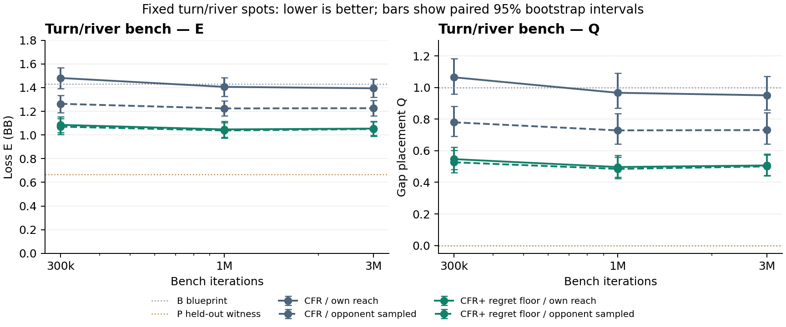

# CFR+ progress against v0.4.0

[PR #171](https://github.com/dberweger2017/deepcfr-texas-no-limit-holdem-6-players/pull/171) is merged after review, 27 parity tests, four Rust tests and green CI. Three CFR+ lineages trained to 1B nodes from main `60f516d`, using seeds 2026100601/02/03, regret floor zero and production traverser-reach averaging. All nine checkpoints and six native exports carry the correct label; every checkpoint regret is nonnegative. [Checkpoint/export hashes](hu20-cfr-plus-artifacts/checkpoints-manifest.json).

**The frozen arena is running; the release decision is pending.** It uses [the predeclared protocol](../hu20-cfr-plus-confirmation.md), 12,288 native-pressure blocks, 2,048 LBR blocks and 256 for each other panel (411,648 hands). A separate direct CFR+ average–v0.4.0 match has 12,288 blocks (73,728 hands). All compute is free local M1/M4. The outcome-blind pilot projects about 1.15 hours for the panel arena with 50% headroom.

Full-game playing results and absolute LBR-opponent win rates will appear here after every frozen coordinate completes and independently replays. Common-opponent panel contrasts are distinct from direct policy-versus-policy play. The M4 completed its six arena models before starting the separately approved one-lineage full-export turn/river comparison. Its outcome-blind pilot took 39.389 seconds and 4.59 GiB, without swap growth; [the posted refined quote](https://github.com/dberweger2017/deepcfr-texas-no-limit-holdem-6-players/pull/171#issuecomment-6011704579) is 26–40 minutes for the remaining 39 boards, with a two-hour cap. The M1 continues the required arena; optional work runs only on the now-idle M4. No partial loss scores have been inspected.

**Completed turn/river bench evidence, 3M iterations.** These policies train only on fixed turn roots; they are not the new full-game exports. E is best-response loss in BB on those spots. Q=(E−P)/(B−P) places that loss between the blueprint B and held-out witness P; lower is better. Intervals are paired 95% board-bootstrap intervals over the same 40 boards. [Published #169 source](https://github.com/dberweger2017/deepcfr-texas-no-limit-holdem-6-players/pull/169#issuecomment-6005846837).

| Bench procedure | Policy | E, BB [95%] | Q [95%] |
| --- | --- | ---: | ---: |
| CFR | Traverser-reach avg | 1.394 [1.319, 1.472] | 0.951 [0.859, 1.072] |
| CFR | Opponent-sampled avg | 1.226 [1.160, 1.292] | 0.731 [0.644, 0.840] |
| CFR | Current | 3.066 [2.659, 3.510] | 3.139 [2.576, 3.789] |
| CFR+ floor | Traverser-reach avg | 1.054 [0.996, 1.114] | 0.507 [0.446, 0.580] |
| CFR+ floor | Opponent-sampled avg | 1.050 [0.991, 1.110] | 0.501 [0.441, 0.575] |
| CFR+ floor | Current | 1.283 [1.196, 1.369] | 0.807 [0.721, 0.911] |

B blueprint: **1.431 [1.321, 1.536] BB**; P held-out witness: **0.667 [0.639, 0.697] BB**. Both are the same #149 B500M lineage references used in #162/#169. The production CFR+ average helps relative to base opponent-sampled averaging (paired ΔE −0.171 [−0.205, −0.139] BB), but neither CFR+ average meets #169’s upper-Q ≤0.3 gap criterion.

For v0.4.1, the primary full-game average−v0.4.0 contrast must have LBR lower bound >0, native-pressure lower bound >−10, and no other panel upper bound <−20 BB/100, with paired 95% intervals. This rule is unchanged. Passing still requires owner confirmation before shipping. The bench gain motivates this test; it does not predict its result.
