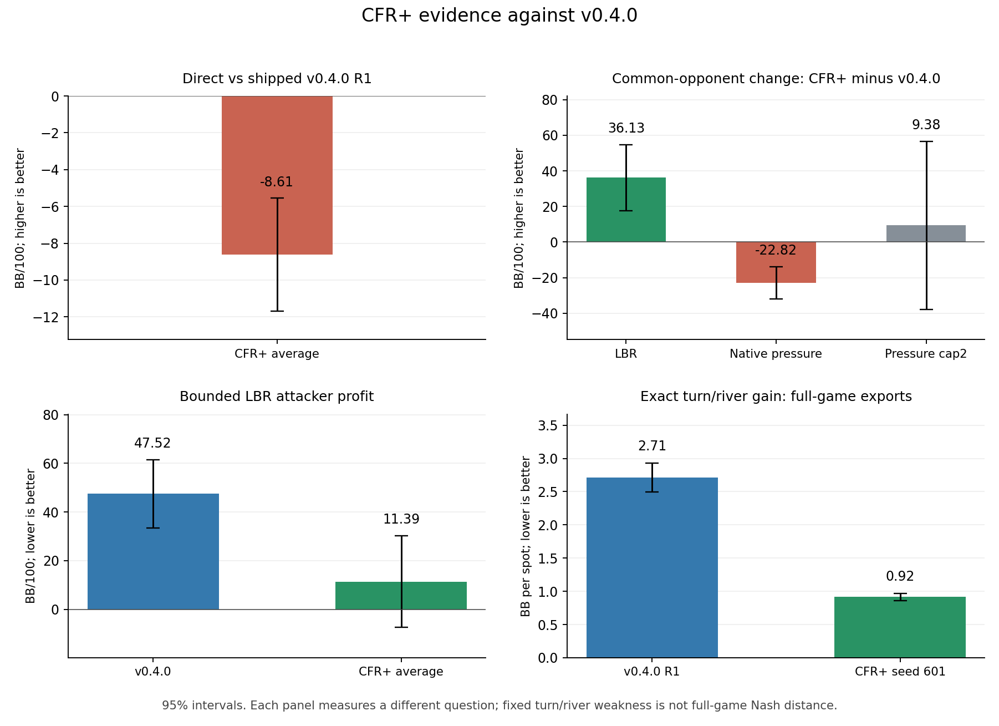

# 0.4.0-shield: CFR+ owner review packet

**Owner publication decision: no release, tag or pre-release for this candidate.** After the direct confirmation showed a loss, the owner declined `v0.4.1-rc1`; v0.4.0 stays stable. **0.4.0-shield** (short **0.4.0-s**) is the friendly name of the tested CFR+ traverser-reach average models for future checks, referring to lower measured weakness on the tested probes. It is a model name, not a software release version or a claim of lower full-game exploitability. [Exact seeds and export hashes](hu20-cfr-plus-artifacts/shield-model-identity.json). This packet preserves both gains and regressions and reports the frozen-rule result.

[#171](https://github.com/dberweger2017/deepcfr-texas-no-limit-holdem-6-players/pull/171) merged after review, 27 native parity tests, four Rust tests and green CI. Three 1B-node CFR+ lineages trained from merged main `60f516d` with `--regret-floor 0`, seeds 2026100601/02/03 and traverser-reach averaging. All nine milestone checkpoints and six exports have verified labels and SHA256s; every stored regret is nonnegative. [Manifest](hu20-cfr-plus-artifacts/checkpoints-manifest.json). Free local M1/M4 only.

**Direct head-to-head against the shipped policy.** The exact arena-tested CFR+ averages play v0.4.0 R1 (seed 2026093001). Every deal is played twice with seats swapped. The primary overall result averages the three CFR+ lineages within each deal block. Positive BB/100 means CFR+ wins. Paired 95% Student-t intervals use 49,152 independent deal blocks, not separate seats or lineage pairs. [Labels declared before the fresh pilot](https://github.com/dberweger2017/deepcfr-texas-no-limit-holdem-6-players/pull/171#issuecomment-6012048061); [outcome-blind sizing quote](https://github.com/dberweger2017/deepcfr-texas-no-limit-holdem-6-players/pull/171#issuecomment-6012095389). Pilot root 202610061001 is excluded; final root 202610061101 was never used previously.

| Primary vs shipped R1 | CFR+ BB/100 [95%] | Predeclared label |
| --- | --- | --- |
| Three-lineage overall | -8.61 [-11.69, -5.53] | worse |
| CFR+ seed 2026100601 | -9.64 [-13.07, -6.21] | worse |
| CFR+ seed 2026100602 | -7.99 [-11.43, -4.55] | worse |
| CFR+ seed 2026100603 | -8.20 [-11.63, -4.78] | worse |

Achieved individual-pair half-widths: **3.38–3.44 BB/100** (requested ≤5; projected maximum 4.00). The frozen sample was not extended after scores.

**Secondary: all nine lineage pairings.** These share deal blocks; their exploratory intervals are not independent evidence or multiplicity-adjusted claims.

| CFR+ seed | v0.4.0 seed | CFR+ BB/100 [95%] | Label |
| --- | --- | --- | --- |
| 2026100601 | 2026093001 | -9.64 [-13.07, -6.21] | worse |
| 2026100601 | 2026093002 | -8.47 [-11.84, -5.09] | worse |
| 2026100601 | 2026093003 | -13.01 [-16.44, -9.59] | worse |
| 2026100602 | 2026093001 | -7.99 [-11.43, -4.55] | worse |
| 2026100602 | 2026093002 | -8.41 [-11.79, -5.03] | worse |
| 2026100602 | 2026093003 | -12.09 [-15.52, -8.66] | worse |
| 2026100603 | 2026093001 | -8.20 [-11.63, -4.78] | worse |
| 2026100603 | 2026093002 | -8.30 [-11.68, -4.91] | worse |
| 2026100603 | 2026093003 | -13.25 [-16.68, -9.83] | worse |

Nine-pair secondary overall: **-9.93 [-12.19, -7.67] BB/100**. The earlier matched-pair exploratory run is retained in the appendix and does not replace this fresh confirmation.

**Frozen arena: common-opponent performance.** These contrasts compare policies against the same rival on matched deals, rather than playing them against each other. All values below are BB/100 with paired 95% intervals over three fixed lineages and both seats. Positive change favors CFR+. The overall estimate gives all thirteen panels equal weight on the 256 common blocks; oversampled safeguards do not receive more weight.

| Contrast | Equal-panel overall BB/100 [95%] |
| --- | --- |
| CFR+ average − v0.4.0 | 7.30 [-10.18, 24.77] |
| CFR+ current − v0.4.0 | 8.88 [-5.53, 23.29] |
| CFR+ average − #165 O | -12.67 [-31.79, 6.45] |

| Panel | Blocks | v0.4.0 absolute | CFR+ average absolute | CFR+ average − v0.4.0 |
| --- | --- | --- | --- | --- |
| uniform | 256 | 88.41 [44.56, 132.27] | 128.84 [73.46, 184.22] | 40.43 [-6.39, 87.25] |
| passive | 256 | 79.69 [41.18, 118.19] | 129.56 [87.27, 171.84] | 49.87 [14.47, 85.27] |
| minraise-cap2 | 256 | 95.64 [36.17, 155.11] | 87.43 [25.14, 149.73] | -8.20 [-65.83, 49.42] |
| pressure-cap2 | 256 | 40.89 [-1.54, 83.31] | 50.26 [-3.07, 103.59] | 9.38 [-37.82, 56.57] |
| tight_passive | 256 | 44.69 [36.97, 52.41] | 43.33 [33.37, 53.28] | -1.37 [-8.11, 5.37] |
| loose_passive | 256 | 13.48 [-12.44, 39.40] | 32.75 [-1.78, 67.28] | 19.27 [-5.25, 43.80] |
| tight_aggressive | 256 | 46.29 [28.21, 64.37] | 37.83 [13.99, 61.66] | -8.46 [-28.41, 11.49] |
| loose_aggressive | 256 | 13.38 [-20.79, 47.55] | 27.57 [-23.15, 78.30] | 14.19 [-26.58, 54.96] |
| pot_pressure | 256 | 27.21 [-11.36, 65.78] | 26.56 [-14.19, 67.31] | -0.65 [-25.93, 24.63] |
| train_pressure | 256 | -2.38 [-28.85, 24.09] | -4.39 [-39.30, 30.51] | -2.02 [-32.19, 28.15] |
| native-pressure | 12288 | 125.96 [118.35, 133.56] | 103.14 [93.98, 112.30] | -22.82 [-31.83, -13.80] |
| selective-stackoff | 256 | 26.92 [11.75, 42.09] | 24.71 [5.45, 43.97] | -2.21 [-22.31, 17.88] |
| lbr | 2048 | -47.52 [-61.57, -33.48] | -11.39 [-30.30, 7.51] | 36.13 [17.55, 54.70] |

LBR contrast **+36.13 [17.55, 54.70]**; native-pressure contrast **−22.82 [−31.83, −13.80] BB/100**. Both policies profit against native pressure; CFR+ earns less.

**Pressure panels and secondary policies, side by side.** Historical #165 O means its opponent-sampled average (called T in this run); the CFR+ average here is the production traverser-reach export.

| Panel | CFR+ average − R | CFR+ current − R | CFR+ average − #165 O |
| --- | --- | --- | --- |
| pressure-cap2 | 9.38 [-37.82, 56.57] | 14.45 [-27.57, 56.48] | -30.83 [-77.02, 15.37] |
| native-pressure | -22.82 [-31.83, -13.80] | -19.70 [-27.69, -11.70] | -29.79 [-38.53, -21.04] |

**LBR distance-from-Nash probe.** The bounded local best-response attacker's win rate is a lower bound on exploitability; lower is better. A negative interval endpoint reflects sampling uncertainty, not negative theoretical exploitability. This attacker can miss weaknesses and cannot certify equilibrium.

| Policy | LBR attacker BB/100 [95%] |
| --- | --- |
| v0.4.0 R1–R3 mean | 47.52 [33.48, 61.57] |
| CFR+ production average, three-lineage mean | 11.39 [-7.51, 30.30] |
| CFR+ current, three-lineage mean | 21.84 [5.32, 38.36] |
| #165 opponent-sampled average, three-lineage mean | 24.17 [7.05, 41.30] |

**Distance from equilibrium on turn/river spots: full-game exports.** The shipped R1 export and CFR+ average seed 2026100601 use the identical #149 lock-only pipeline on all 40 frozen boards and both seats. E is exact best-response gain above the retained approximate-equilibrium reference, in BB per spot; lower is better. Both policies use the same original B500M ranges, restricted action trees and reference solves (0.2%-of-pot residual target). This is conditional turn/river weakness, not full-game Nash distance. Intervals use the same 2,000 paired board-bootstrap draws for both policies.

Q=(E−P)/(B−P): Q=1 is the common original B500M blueprint B and Q=0 the held-out witness P. Neither anchor is the shipped R1 by definition, and P is not Nash.

| Full-game export | E, BB [95%] | Q [95%] |
| --- | --- | --- |
| v0.4.0 shipped R1 current | 2.715 [2.492, 2.932] | 2.679 [2.325, 3.058] |
| CFR+ seed 2026100601 traverser-reach average | 0.916 [0.863, 0.970] | 0.326 [0.287, 0.363] |

Paired change in E: **-1.799 [-2.005, -1.602] BB**. Common anchors in this rerun: B **1.431 [1.321, 1.536] BB**, P **0.667 [0.639, 0.697] BB**. Missing/zero-mass keys keep each policy's uniform fallback; there is no policy-specific board filtering.

**Completed turn/river bench evidence, 3M iterations.** These policies train only on fixed turn roots; they are not the new full-game exports. E is best-response loss in BB on those spots. Q=(E−P)/(B−P) places that loss between the blueprint B and held-out witness P; lower is better. Intervals are paired 95% board-bootstrap intervals over the same 40 boards. [Published #169 source](https://github.com/dberweger2017/deepcfr-texas-no-limit-holdem-6-players/pull/169#issuecomment-6005846837).

| Bench procedure | Policy | E, BB [95%] | Q [95%] |
| --- | --- | ---: | ---: |
| CFR | Traverser-reach avg | 1.394 [1.319, 1.472] | 0.951 [0.859, 1.072] |
| CFR | Opponent-sampled avg | 1.226 [1.160, 1.292] | 0.731 [0.644, 0.840] |
| CFR | Current | 3.066 [2.659, 3.510] | 3.139 [2.576, 3.789] |
| CFR+ floor | Traverser-reach avg | 1.054 [0.996, 1.114] | 0.507 [0.446, 0.580] |
| CFR+ floor | Opponent-sampled avg | 1.050 [0.991, 1.110] | 0.501 [0.441, 0.575] |
| CFR+ floor | Current | 1.283 [1.196, 1.369] | 0.807 [0.721, 0.911] |

B blueprint: **1.431 [1.321, 1.536] BB**; P held-out witness: **0.667 [0.639, 0.697] BB**. Both are the same #149 B500M lineage references used in #162/#169. The production CFR+ average helps relative to base opponent-sampled averaging (paired ΔE −0.171 [−0.205, −0.139] BB), but neither CFR+ average meets #169’s upper-Q ≤0.3 gap criterion.

The bench compares the CFR training rule used for v0.4.0 with CFR+ on fixed turn roots. These bench policies are separate from the full-game exports above. The full-game comparison also changes training budget and current versus average extraction, so it does not isolate the regret floor alone.

**Native-pressure losses by street.** To avoid counting a hand's payoff repeatedly, assign each hand once to the street of its last decision facing an opponent raise or jam. No-facing includes blind completion. The table shows each disjoint group's contribution to total BB/100; the difference rows sum to −22.82. These are descriptive trajectory groups, not causal losses attributable to a street.

| Last facing-response street | v0.4.0 return contribution | CFR+ return contribution | CFR+ − R contribution |
| --- | --- | --- | --- |
| flop | 6.87 [2.64, 11.09] | -0.13 [-5.64, 5.38] | -7.00 [-12.93, -1.07] |
| no-facing-response | -5.58 [-5.74, -5.42] | -6.69 [-6.88, -6.50] | -1.11 [-1.24, -0.99] |
| preflop | 89.69 [84.88, 94.50] | 88.66 [82.39, 94.94] | -1.03 [-7.31, 5.25] |
| river | 10.70 [6.87, 14.52] | 6.40 [2.62, 10.18] | -4.30 [-8.77, 0.17] |
| turn | 24.28 [20.03, 28.53] | 14.90 [10.10, 19.70] | -9.38 [-14.91, -3.84] |

**Facing-action responses and chips lost per situation.** Frequencies are percentages of observed decisions facing a non-jam raise or actual all-in raise. All figures have exploratory 95% deal-block cluster intervals; ratios use the delta method. Gross chips lost is the negative final payoff, or zero on winning/tied hands, conditional on visiting the situation; it does not subtract winnings. A hand may visit several rows, so these values are not additive and do not estimate the causal value of an action. Committed chips measure immediate payment, not loss. One BB = 100 chips. Equal-stack jams cannot be re-raised, so their raise frequency is structurally zero. Counts, net losses (negative means profit) and complete response-specific details are in the appendix.

| Street | Facing | Policy | Fold % | Call % | Raise % | Gross chips lost / visit | Chips committed / visit |
| --- | --- | --- | --- | --- | --- | --- | --- |
| preflop | raise | v0.4.0 | 17.7 [17.3, 18.0] | 45.6 [45.1, 46.0] | 36.8 [36.2, 37.3] | 390.1 [383.5, 396.7] | 339.6 [335.1, 344.2] |
| preflop | raise | CFR+ avg | 20.1 [19.7, 20.6] | 38.9 [38.3, 39.5] | 41.0 [40.3, 41.6] | 386.3 [378.3, 394.2] | 384.1 [378.1, 390.1] |
| preflop | jam | v0.4.0 | 1.1 [0.7, 1.5] | 98.9 [98.5, 99.3] | 0.0 [0.0, 0.0] (unavailable) | 727.9 [686.0, 769.8] | 622.8 [615.5, 630.0] |
| preflop | jam | CFR+ avg | 3.9 [2.9, 4.8] | 96.1 [95.2, 97.1] | 0.0 [0.0, 0.0] (unavailable) | 810.9 [759.2, 862.5] | 564.6 [554.6, 574.6] |
| flop | raise | v0.4.0 | 19.9 [19.4, 20.4] | 44.4 [43.9, 44.9] | 35.7 [35.1, 36.3] | 504.7 [495.1, 514.4] | 253.2 [248.9, 257.4] |
| flop | raise | CFR+ avg | 23.5 [22.7, 24.2] | 34.5 [33.8, 35.3] | 42.0 [41.2, 42.9] | 510.7 [497.6, 523.9] | 285.7 [279.0, 292.4] |
| flop | jam | v0.4.0 | 10.5 [9.0, 12.0] | 89.5 [88.0, 91.0] | 0.0 [0.0, 0.0] (unavailable) | 703.8 [657.4, 750.1] | 400.7 [386.2, 415.2] |
| flop | jam | CFR+ avg | 8.1 [6.1, 10.1] | 91.9 [89.9, 93.9] | 0.0 [0.0, 0.0] (unavailable) | 723.3 [660.9, 785.6] | 436.6 [416.5, 456.7] |
| turn | raise | v0.4.0 | 10.4 [10.0, 10.9] | 44.6 [43.9, 45.3] | 45.0 [44.2, 45.7] | 565.1 [551.7, 578.5] | 340.7 [334.5, 346.9] |
| turn | raise | CFR+ avg | 10.5 [9.8, 11.1] | 40.3 [39.2, 41.5] | 49.2 [48.0, 50.4] | 569.8 [549.4, 590.2] | 397.8 [386.7, 408.9] |
| turn | jam | v0.4.0 | 8.0 [6.5, 9.4] | 92.0 [90.6, 93.5] | 0.0 [0.0, 0.0] (unavailable) | 691.9 [641.2, 742.6] | 473.5 [457.9, 489.2] |
| turn | jam | CFR+ avg | 13.0 [10.5, 15.4] | 87.0 [84.6, 89.5] | 0.0 [0.0, 0.0] (unavailable) | 707.9 [646.1, 769.6] | 408.6 [388.2, 429.0] |
| river | raise | v0.4.0 | 10.2 [9.6, 10.8] | 42.3 [41.3, 43.4] | 47.4 [46.3, 48.6] | 530.9 [514.0, 547.9] | 457.5 [446.5, 468.5] |
| river | raise | CFR+ avg | 9.6 [8.7, 10.6] | 42.9 [41.2, 44.5] | 47.5 [45.8, 49.2] | 524.8 [498.6, 551.0] | 473.4 [455.3, 491.5] |
| river | jam | v0.4.0 | 10.0 [7.9, 12.2] | 90.0 [87.8, 92.1] | 0.0 [0.0, 0.0] (unavailable) | 656.2 [591.0, 721.5] | 286.7 [272.4, 301.0] |
| river | jam | CFR+ avg | 23.1 [18.1, 28.2] | 76.9 [71.8, 81.9] | 0.0 [0.0, 0.0] (unavailable) | 724.3 [623.0, 825.5] | 260.0 [237.4, 282.6] |

**Off-menu sizes and repeated pressure.** The frozen harness executes exact native amounts; it has **no bet-size translator**. V1 records size bands in the information key, without replacing the bet. Every native-pressure opponent raise was in the recorded uncapped v1 menu: **zero off-menu-size events or translated events** in these audited hands. Losses therefore do not concentrate in translated or off-menu sizes. The native opponent keeps making minimum raises, including beyond the cap2 panel's two-raise limit. A separate whole-hand split by the total number of opponent raises shows where the relative shortfall lies; it includes policy-dependent selection and does not establish why.

| Whole-hand group | v0.4.0 hand share % [95%] | CFR+ hand share % [95%] | CFR+ − R return contribution, BB/100 [95%] |
| --- | --- | --- | --- |
| at-most-two-opponent-raises | 57.54 [57.09, 58.00] | 66.30 [65.75, 66.86] | 3.82 [-2.01, 9.64] |
| more-than-two-opponent-raises | 42.46 [42.00, 42.91] | 33.70 [33.14, 34.25] | -26.63 [-35.07, -18.20] |

**Frozen-rule result: not met.** LBR lower >0 passes; native-pressure lower >−10 fails; no other panel upper <−20 passes. Native-pressure half-width was 9.01 BB/100 versus the prospectively estimated 7.72 from #165's variance; no sample extension followed the result. These checks describe the unchanged original rule and do not authorize publication.

**What this means.** CFR+ improves the bounded LBR probe and the controlled turn/river trainer bench, but the frozen common-opponent arena records a native-pressure regression. The fresh direct test tells how the exact candidate performs against the shipped policy: -8.61 [-11.69, -5.53] BB/100, labeled worse by the predeclared rule. The pressure shortfall appears in repeated uncapped minimum-raise trajectories, with turn and flop contributing most of the relative difference; there is no translated-size explanation in this harness. These measurements answer different questions, and conditional weakness probes do not certify Nash equilibrium or general playing strength. The full-game export comparison includes changes in budget and extraction as well as the regret floor. After reviewing the direct confirmation loss, the owner decided against publishing this candidate as rc1; v0.4.0 stays stable. No release or pre-release was published.

Independent verification: **411,648 arena hands + 884,736 fresh direct hands**, plus the retained 73,728 earlier exploratory hands. Every action and settlement replays; raw chip arithmetic matches the paired intervals. All 160 full-export native metrics and E/Q bootstrap summaries independently recompute. [Complete tables and audits](hu20-cfr-plus-details.md), [frozen protocol](../hu20-cfr-plus-confirmation.md), [research archive index](../../RESULTS_INDEX.md). The research ZIP is verified at `~/Local/Research-Cloud/PR-171-HU20-cfr-plus/hu20-cfr-plus-complete-20261006.zip`: **1,065 files / 14,320,364,078 logical bytes**, ZIP **8,077,888,199 bytes**, every member SHA256 checked on readback. [Archive receipt](hu20-cfr-plus-artifacts/archive-receipt.json); [Drive folder](https://drive.google.com/drive/folders/1QiQiGUu5EARluoId5dV4XHbpx5JDslWx). Native Drive/FileProvider now reports uploaded=true, uploading=false, no conflict and exact size. [Native receipt](hu20-cfr-plus-artifacts/drive-native-upload.json). The connector has not yet returned the archive in its listing; independent cloud file-ID/checksum confirmation is pending. Originals remain and no synced files are deleted or evicted. The main ZIP preserves the research snapshot before the later naming/publication decision; final closeout documentation and receipts are retained separately.
