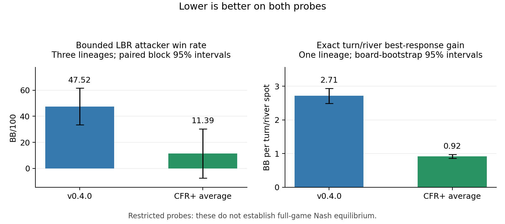

# CFR+ progress against v0.4.0

**Verified progress, October 6, 10:23 Madrid. No release or pre-release is authorized.** The owner reviews the numbers and must approve `v0.4.1-rc1` explicitly in chat; v0.4.0 stays stable.

[#171](https://github.com/dberweger2017/deepcfr-texas-no-limit-holdem-6-players/pull/171) merged after review, 27 parity tests, four Rust tests and green CI. Three 1B-node CFR+ lineages, all nine 100M/500M/1B checkpoints and six native current/traverser-reach-average exports are complete, correctly labeled `regret-floor-0` and hash-verified. Training source main `60f516d`; seeds 2026100601/02/03. [Checkpoint/export manifest](hu20-cfr-plus-artifacts/checkpoints-manifest.json). Free M1/M4 only.

**Completed frozen arena:** 411,648 hands and 2,286,594 actions independently replay; all raw-chip estimates and intervals match. The original release rule is **not met**: LBR lower >0 passes, native-pressure lower >−10 fails, no other panel upper <−20 passes. This is the mechanical result, without a release recommendation. Positive contrasts favor CFR+; 95% paired deal-block intervals, BB/100.

| Panel | CFR+ production average − v0.4.0 [95%] |
| --- | --- |
| uniform | 40.43 [-6.39, 87.25] |
| passive | 49.87 [14.47, 85.27] |
| minraise-cap2 | -8.20 [-65.83, 49.42] |
| pressure-cap2 | 9.38 [-37.82, 56.57] |
| tight_passive | -1.37 [-8.11, 5.37] |
| loose_passive | 19.27 [-5.25, 43.80] |
| tight_aggressive | -8.46 [-28.41, 11.49] |
| loose_aggressive | 14.19 [-26.58, 54.96] |
| pot_pressure | -0.65 [-25.93, 24.63] |
| train_pressure | -2.02 [-32.19, 28.15] |
| native-pressure | -22.82 [-31.83, -13.80] |
| selective-stackoff | -2.21 [-22.31, 17.88] |
| lbr | 36.13 [17.55, 54.70] |

**Pressure panels and secondary contrasts.** #165 O is the historical opponent-sampled average; the new average is traverser-reach.

| Panel | CFR+ average − R | CFR+ current − R | CFR+ average − #165 O |
| --- | --- | --- | --- |
| pressure-cap2 | 9.38 [-37.82, 56.57] | 14.45 [-27.57, 56.48] | -30.83 [-77.02, 15.37] |
| native-pressure | -22.82 [-31.83, -13.80] | -19.70 [-27.69, -11.70] | -29.79 [-38.53, -21.04] |

Both policies win against native pressure: v0.4.0 **125.96 [118.35, 133.56]**, CFR+ average **103.14 [93.98, 112.30] BB/100**. CFR+ wins less.

**Completed earlier exploratory direct match:** 73,728 hands / 332,508 actions independently replay; three matched lineage pairs, root 202610060901. CFR+ result **-14.19 [-18.97, -9.40] BB/100**. This is distinct from the owner's new shipped-R1 primary.

**New required direct confirmation:** all **884,736 hands** have completed on fresh root 202610061101; independent replay/audit is running. The primary is shipped R1 versus each of three exact CFR+ arena averages and their equal-weight deal-block mean; all nine lineage pairings are secondary. 49,152 blocks per pair, duplicate deals with seats swapped. [Labels and pilot predeclared](https://github.com/dberweger2017/deepcfr-texas-no-limit-holdem-6-players/pull/171#issuecomment-6012048061); [outcome-blind quote](https://github.com/dberweger2017/deepcfr-texas-no-limit-holdem-6-players/pull/171#issuecomment-6012095389). No new result is reported before its audit.

**Completed identical-pipeline full-export turn/river comparison:** shipped R1 and CFR+ average seed 2026100601 on all 40 common #149 boards, both seats. All 160 native metrics and 2,000 paired board-bootstrap summaries independently recompute. Lower E/Q is better; E is best-response gain above the approximate-equilibrium reference on restricted turn/river trees, not full-game Nash distance. Q=(E−P)/(B−P) uses common B500M blueprint/witness anchors; Q=1 is not the shipped R1 by definition, and the witness is not Nash.

| Full-game export | E, BB [95%] | Q [95%] |
| --- | --- | --- |
| v0.4.0 shipped R1 current | 2.715 [2.492, 2.932] | 2.679 [2.325, 3.058] |
| CFR+ 2026100601 traverser-reach average | 0.916 [0.863, 0.970] | 0.326 [0.287, 0.363] |

Paired change in E: **-1.799 [-2.005, -1.602] BB**. Both policies use identical frozen ranges, trees, references and conversion. This full-game comparison changes budget and current/average extraction as well as regret floor.

**Native-pressure street diagnostic:** each hand is assigned once to its last decision facing an opponent raise/jam; blind completion is not facing a raise. Contributions are additive BB/100 with exploratory paired 95% intervals, not causal street losses.

| Last facing-response street | R return contribution | CFR+ return contribution | CFR+ − R contribution |
| --- | --- | --- | --- |
| flop | 6.87 [2.64, 11.09] | -0.13 [-5.64, 5.38] | -7.00 [-12.93, -1.07] |
| no-facing-response | -5.58 [-5.74, -5.42] | -6.69 [-6.88, -6.50] | -1.11 [-1.24, -0.99] |
| preflop | 89.69 [84.88, 94.50] | 88.66 [82.39, 94.94] | -1.03 [-7.31, 5.25] |
| river | 10.70 [6.87, 14.52] | 6.40 [2.62, 10.18] | -4.30 [-8.77, 0.17] |
| turn | 24.28 [20.03, 28.53] | 14.90 [10.10, 19.70] | -9.38 [-14.91, -3.84] |

**Off-menu diagnostic:** no translator exists in this frozen arena and zero native-pressure opponent bet sizes fell outside its recorded uncapped v1 menu. The relative shortfall is concentrated descriptively in hands with more than two opponent raises: **-26.63 [-35.07, -18.20] BB/100**. The at-most-two group contributes **3.82 [-2.01, 9.64]**. Policy-dependent trajectories prevent causal attribution. [Full fold/call/raise frequencies, chips lost and committed, coverage, partitions and intervals](hu20-cfr-plus-artifacts/pressure-description.json).

**Completed turn/river bench evidence, 3M iterations.** These policies train only on fixed turn roots; they are not the new full-game exports. E is best-response loss in BB on those spots. Q=(E−P)/(B−P) places that loss between the blueprint B and held-out witness P; lower is better. Intervals are paired 95% board-bootstrap intervals over the same 40 boards. [Published #169 source](https://github.com/dberweger2017/deepcfr-texas-no-limit-holdem-6-players/pull/169#issuecomment-6005846837).

| Bench procedure | Policy | E, BB [95%] | Q [95%] |
| --- | --- | ---: | ---: |
| CFR | Traverser-reach avg | 1.394 [1.319, 1.472] | 0.951 [0.859, 1.072] |
| CFR | Opponent-sampled avg | 1.226 [1.160, 1.292] | 0.731 [0.644, 0.840] |
| CFR | Current | 3.066 [2.659, 3.510] | 3.139 [2.576, 3.789] |
| CFR+ floor | Traverser-reach avg | 1.054 [0.996, 1.114] | 0.507 [0.446, 0.580] |
| CFR+ floor | Opponent-sampled avg | 1.050 [0.991, 1.110] | 0.501 [0.441, 0.575] |
| CFR+ floor | Current | 1.283 [1.196, 1.369] | 0.807 [0.721, 0.911] |

B blueprint: **1.431 [1.321, 1.536] BB**; P held-out witness: **0.667 [0.639, 0.697] BB**. Both are the same #149 B500M lineage references used in #162/#169. The production CFR+ average helps relative to base opponent-sampled averaging (paired ΔE −0.171 [−0.205, −0.139] BB), but neither CFR+ average meets #169’s upper-Q ≤0.3 gap criterion.

The owner review packet will replace this progress page when the fresh direct audit finishes. All raw files, checkpoints, exports, logs, source snapshots and manifests remain in the owned root; ZIP/member verification is pending at `~/Local/Research-Cloud/PR-171-HU20-cfr-plus/`. No Drive deletion or eviction. [Frozen protocol](../hu20-cfr-plus-confirmation.md).
