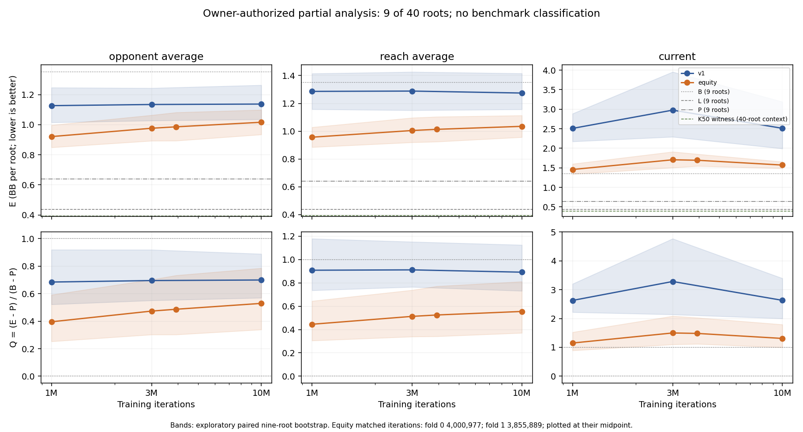

# Owner-requested partial K50 analysis: nine of 40 roots

On the nine completed roots, the K50 opponent-sampled average has lower mean held-out loss than v1: the matched contrast is **−0.1485 BB**, with an exploratory paired-bootstrap interval **[−0.3181, +0.0341]**. At 10M, K50 minus v1 is **−0.1211 [−0.2692, +0.0388] BB**. These intervals include zero and do not establish the frozen requirement that the matched upper bound be below −0.10 BB. The 40-root primary remains **unclassified**, with 31 roots missing.

The owner requested this analysis after [#230](https://github.com/dberweger2017/deepcfr-texas-no-limit-holdem-6-players/pull/230) merged its AC-stop record. This authorizes the first numeric inspection of all nine completed roots. Earlier statements that scores were uninspected describe the stop and its blind evidence review; those records and all failure latches remain unchanged. No scoring, training, official full-report command or retry occurs. Any future completion must disclose that these nine outcomes have now been inspected.

The sample is the predetermined first nine sorted frozen roots: five retained from #225 and four newly completed in #230, with five from fold 0 and four from fold 1. Neither timing-pilot results nor the interrupted tenth root is included. Every score and B/L/P reference is restored from its accepted archive with exact whole/archive-manifest/member hashes. [Retrieval provenance](hu20-equity-bench-partial-analysis-artifacts/partial-restoration.json).

E is the mean of the two seat losses in BB, then the mean across these nine roots. Q is the ratio of means `(E − P)/(B − P)`, with B the blueprint, L the per-root v1 witness and P the cross-fitted v1 witness. All intervals here use an **exploratory nine-root** paired bootstrap: 2,000 resamples, Random(202610050002), percentile indices 49/1949. This changes the resampled dataset size from the frozen 40 to the observed nine and is not a qualification result. Intervals describe variation among these nine roots, exclude missing-root and training-seed uncertainty, and are unadjusted descriptive intervals. The two seats are not independent samples.

| Nine-root reference | E, BB [exploratory 95%] |
| --- | ---: |
| B: blueprint | 1.3516 [1.1618, 1.5620] |
| L: per-root v1 witness | 0.4366 [0.3649, 0.5123] |
| P: cross-fitted v1 witness | 0.6396 [0.5999, 0.6928] |

The matched K50 average has E=0.9862 and Q=0.4867, compared with v1 at 3M E=1.1347 and Q=0.6953. It removes more of the blueprint-to-P gap on this subset, but still sits 0.3465 BB above P and 0.5496 BB above L. The global K50 witness E=0.3917 is a full-corpus, three-lineage context value; subtracting it gives +0.5945 BB at matched K50 and +0.6248 BB at 10M. These are descriptive context gaps, not comparisons against a matched nine-root witness.

The apparent gain varies strongly by fold:

| Evaluation fold | Completed roots | Matched K50 − v1 at 3M, BB | 10M K50 − v1, BB |
| --- | ---: | ---: | ---: |
| 0 | 5 | −0.3294 | −0.2164 |
| 1 | 4 | +0.0776 | −0.0019 |

Seven of nine roots improve at matched iterations; six of nine improve at 10M. Fold 0 supplies the average improvement; fold 1's matched point is worse and its 10M point is nearly unchanged. These small, unequal fold subsets do not establish a stable advantage across the full corpus or independent training seeds.

The learning curves also caution against assuming that more iterations will close the loss gap:

| Opponent-sampled average | 1M E | 3M E | Matched E | 10M E |
| --- | ---: | ---: | ---: | ---: |
| v1 | 1.1270 | 1.1347 | — | 1.1376 |
| K50 | 0.9212 | 0.9766 | 0.9862 | 1.0165 |

K50's paired 10M-minus-1M loss change is **+0.0953 [+0.0497, +0.1410] BB** on these nine roots. v1's is **+0.0106 [−0.0678, +0.0940] BB**. K50 retains a lower loss than v1 while its own held-out loss rises across these exports. This finite, partial pattern does not diagnose the training mechanism or prove an asymptotic fixed point, and it does not authorize selecting 1M as a replacement primary checkpoint. Current-policy point estimates remain worse than B at every export for both abstractions; they do not decide the bench.

[All 21 exported E/Q placements](hu20-equity-bench-partial-analysis-artifacts/partial-policy-table.md), [CSV with E minus B/L/P and full-corpus witness context](hu20-equity-bench-partial-analysis-artifacts/partial-policy-table.csv), and [complete derived summary with per-root contrasts](hu20-equity-bench-partial-analysis-artifacts/partial-summary.json) preserve the descriptive results. Matched iterations remain 4,000,977 and 3,855,889; no outcome-based adjustment occurs.

The useful reading is a lower K50 point estimate with substantial uncertainty and a fold discrepancy, alongside held-out loss that increases with training on this subset. This rules out treating the nine-root readout as a demonstrated benchmark pass or full-game qualification. It does not establish a benchmark failure either. Keep roadmap step 4 conditional on complete qualifying evidence; do not infer full-game strength from these fixed-range, single-lineage turn-root policies. No default, release or native trainer change is proposed.

The [independent numeric review](hu20-equity-bench-partial-analysis-artifacts/partial-analysis-review.json) is clear: all 21 E/Q placements, references, paired contrasts, fold means, learning changes and CSV cells reproduce independently within 1e-12. The analysis is [posted on PR230](https://github.com/dberweger2017/deepcfr-texas-no-limit-holdem-6-players/pull/230#issuecomment-6101289186). Derived outputs and reproduction helpers are archived separately in [Drive 1cH3M-B2jdapSpgok_w-wbB1V9FhEN_6x](https://drive.google.com/file/d/1cH3M-B2jdapSpgok_w-wbB1V9FhEN_6x/view), 185,103 bytes /11 payload members. [Member-hash readback](hu20-equity-bench-partial-analysis-artifacts/partial-archive-receipt.json) and [native/cloud upload acceptance](hu20-equity-bench-partial-analysis-artifacts/partial-cloud-upload.json) are complete; accepted input payloads are not duplicated. Small extracted analysis inputs remain ignored and retained. No remote archive byte audit is claimed.
