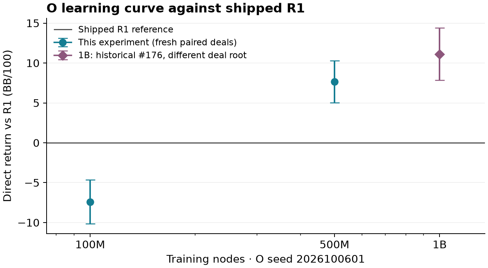

# O learning curve

O is still improving near 1B in this lineage. The direct 1B–500M interval clears zero, so the predeclared scaling to 2B, 5B and 10B was completed. No new matches run before the owner decides.

One training lineage only: seed **2026100601**, linear CFR, opponent-sampled average, v1 cards and original uniform zero-mass fallback. The owner decides v0.4.2. [Protocol](../hu20-learning-curve.md), [predeclaration](https://github.com/dberweger2017/deepcfr-texas-no-limit-holdem-6-players/pull/182#issuecomment-6018408904), [frozen counts and plan hash](https://github.com/dberweger2017/deepcfr-texas-no-limit-holdem-6-players/pull/182#issuecomment-6018482060).

Positive returns favor the first policy. Nominal paired Student-t 95% intervals use independent duplicate deal blocks; swapped seats are averaged inside each block. Labels: lower >0 **better**, upper <0 **worse**, otherwise **no detectable difference**. No multiplicity adjustment or multi-seed/general poker-strength claim.

| Contrast | Deal blocks | BB/100 [95% interval] | Label |
| --- | ---: | ---: | --- |
| Primary A: O@1B vs O@100M | 77,824 | +14.19 [+11.56, +16.81] | better |
| Primary B: O@1B vs O@500M | 65,536 | +5.31 [+2.71, +7.91] | better |
| Secondary C: O@100M vs R1 | 77,824 | -7.41 [-10.16, -4.67] | worse |
| Secondary D: O@500M vs R1 | 77,824 | +7.68 [+5.05, +10.31] | better |

Achieved primary half-widths: **A 2.627, B 2.597 BB/100**; requested ≤3 met. All **598,016 final hands / 2,970,077 actions** and **32,768 pilot hands / 162,192 actions** independently replay with verified settlement, observation, legal-action, deal/seat coverage and raw-chip interval/label arithmetic. No outcome-driven extension.

The 100M and 500M points are this experiment's direct R1 matches. The 1B point **+11.12 [+7.85, +14.39]** is #176's already-audited same-seed result on a different root, visibly distinguished. It is descriptive context, not a new shared-root curve contrast. The A/B rows test checkpoint improvement directly; no transitive inference or subtraction of R1 returns replaces them.

## Inputs and execution

The three #165 pilot checkpoints match its archived member sizes/SHA256s. M4 release trainer built from main **3776305f9e43e584a1c221c217323a609ff5db2b**. Every stored key's normalized accumulator and paired current-policy export passes `src.diagnostics.cfr_average.audit`; the 1B bytes exactly match required O/v0.4.1 SHA256 `571e198266eabc6d8bb9de2d1aa76d9a68be0b2512222ea96874168989c6b74d`. R1 matches shipped hash `4534e7db2f69bedd54098b7eaa3c9bd82450838405ae162270a3b7684db9bedf`.

[Model hashes and checkpoint provenance](hu20-learning-curve-artifacts/models.json), [complete independent audits](hu20-learning-curve-artifacts/audits.json).

Matches use #175's unchanged execution source **8bbfc457**, direct runner/reporter and independent auditor; SHA256 checks include its unchanged policy loader/play dependencies. Main's later optional-fallback loader change is excluded from match execution. Both policies receive only their own observation and independent private action streams.

Pilot root **202610065101** is excluded from fresh final root **202610065201**. Tracked configs/reports and retained readable plans were searched on both Macs before roots were used; broken/unreadable historical paths are explicitly retained. The 4,096-block-per-contrast pilot exposed only SDs, timing, memory, completeness and failures; no pilot means, intervals or labels were inspected. Final counts target a 2.7 half-width and were posted before play. Canonical plan SHA256 `c4be553d00115d0ebe051c9adf66d2183b1b53b0b7469badcdf1887d558ac552` pins counts, roots, exact model identities and orchestration; each runner plan is separately hashed.

Free M4 only, at most three workers, 6-GiB worker RSS, ≥15-GiB free disk and a two-hour final play/report/replay cap. Conservative quoted total with 50% headroom: **48.22 minutes**. Actual frozen admission through play/report/all independent audits: **9.91 minutes**. Largest externally sampled preparation/play/report/audit process RSS: **5.235 GiB**. Scientific runs complete without failures. A premature source-tar extraction was corrected after complete transfer and matching source hashes, before native build or scientific play; its failure receipt remains. A main-versus-#175 loader hash check prompted use of the exact historical match source. No release/tag or new matches are authorized by these findings.

## Research archive and scaled training

The complete [research ZIP](https://drive.google.com/file/d/1V2bbJ9kf0_MTdqwfcoo__XnCMWjAEkbi/view) has **172 members /1,899,498,972 ZIP bytes**, all size/SHA256 verified by readback. Native Drive upload acceptance and independent cloud name/size/parent checks pass; no remote byte re-download is claimed. [RESULTS_INDEX](../../RESULTS_INDEX.md) records hashes and restoration under `~/Local/Research-Cloud/PR-182-HU20-learning-curve/`. Originals and #166's work roots stay untouched; no synced deletion or eviction.

Because B is better, the owner-requested seed-2026100601 opponent-sampled **2B/5B/10B training completed on M4** from the same main-built binary. Completed saves landed at **12.65 /31.51 /62.75 minutes** from launch; total guarded job duration **62.77 minutes**, peak sampled RSS **1.462 GiB**, exit code zero and no guard failure. Final stdout records **10,000,000,355 nodes /19,538,759 iterations /7,227,377 entries**. All three six-member checkpoint ZIPs and the 23-member stable training-tail ZIP pass size/SHA256 readback, native upload acceptance and cloud ID/name/size/parent checks. [Hashes and retrieval](../../RESULTS_INDEX.md), [completion receipt](hu20-learning-curve-artifacts/scaled-finished.json). The scaled checkpoints have not been matched, audited as inference exports or promoted. **No new matches until the owner decides; v0.4.2 remains the owner's release decision.**
