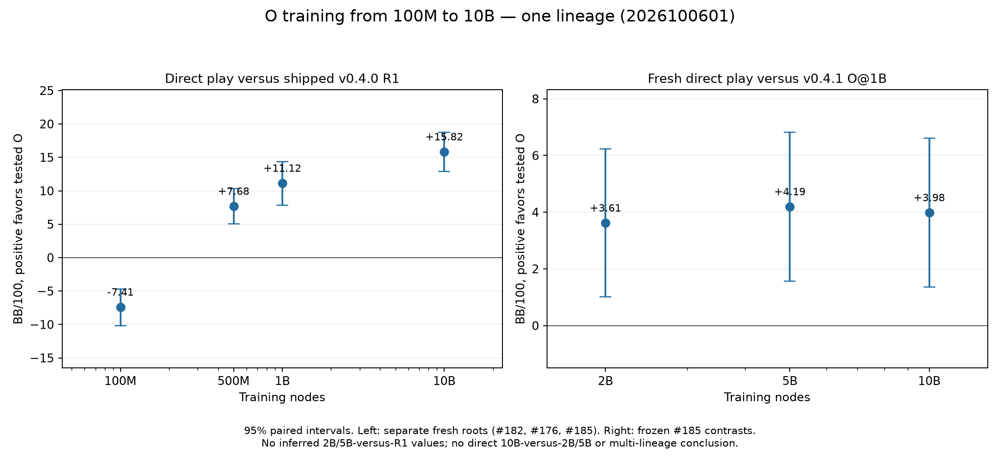

# O at 10B: first-lineage direct improvement

**Current status:** O@10B beats the unchanged v0.4.1 O@1B for seed **2026100601**, **+3.98 [1.35, 6.61] BB/100**, labeled **better** under the predeclared rule. Primary half-width **2.626** meets ≤3. This is **one training lineage only**; the conditional three-lineage confirmation awaits both new completed 10B seeds. No v0.4.2 release decision or package yet.

| Frozen contrast | BB/100 | Paired 95% interval | Label | Half-width |
| --- | ---: | --- | --- | ---: |
| Primary: O@10B − O@1B | +3.98 | [1.35, 6.61] | better | 2.626 |
| Secondary: O@2B − O@1B | +3.61 | [1.01, 6.22] | better | 2.609 |
| Secondary: O@5B − O@1B | +4.19 | [1.56, 6.82] | better | 2.627 |
| Secondary: O@10B − shipped R1 | +15.82 | [12.89, 18.75] | better | 2.930 |

Each contrast contains **61,440 independent duplicate blocks /122,880 hands**. All **491,520 final +32,768 excluded pilot hands /2,763,383 actions** independently replay with matching raw-chip estimates, intervals and labels. [Independent audits](hu20-o-10b-artifacts/audits.json). Pilot means, intervals and labels were not inspected or included in final estimates. Nominal intervals have no multiplicity adjustment. Similar point estimates at 2B, 5B and 10B do not establish a plateau: no direct 10B−2B or 10B−5B contrast was run.

The left panel retains independently measured historical 100M/500M (#182), 1B (#176 first lineage) and fresh 10B (#185) direct matches against shipped R1, with their separate roots. The right panel contains the fresh frozen 2B/5B/10B-versus-1B contrasts. No inferred 2B/5B-versus-R1 values or cross-root subtraction. [SVG](hu20-o-10b-artifacts/strength-vs-nodes.svg), [historical curve](hu20-learning-curve.md).

The owner approved an **8-GiB evaluation/audit guard, one worker at a time**. Full unchanged 10B accumulator audit passes **7,227,377 keys**, 71.15 seconds, peak sampled RSS **6.216 GiB**. [Amendment](https://github.com/dberweger2017/deepcfr-texas-no-limit-holdem-6-players/pull/185#issuecomment-6020980784), [full audit](hu20-o-10b-artifacts/export-audit-10000000000.json). Largest pilot sampled RSS **7.426 GiB**. Final play took **14.42 minutes**; all final/pilot audits completed within the frozen two-hour cap. Fresh final root **202610066201**, excluded pilot **202610066101**; canonical plan SHA256 `a242aeccb1a46214fb7014c1fd72e2d1e66d5d98df3b7e2794acf17904322ad4`. [Freeze before play](https://github.com/dberweger2017/deepcfr-texas-no-limit-holdem-6-players/pull/185#issuecomment-6021112472), [plan](hu20-o-10b-artifacts/final-plan.json), [43.52-minute quote with 50% headroom](hu20-o-10b-artifacts/quote.json). Training guards and every scientific check remain fixed.

Completed run archive **134 verified members /404,635,290 ZIP bytes**, SHA256 `a8e74b482d72e171d5002dc6f88a0239d1ed59fd0b89f28be65c8f4a8be83363`, manifest `59f65431b81368c99389f4afd4b832a37966034d36053b4a28b6b505f0222049`. [Receipt](hu20-o-10b-artifacts/run-archive.json). It stores every final/pilot trace, plan, replay/arithmetic check and runtime receipt, with hash-pinned references to unchanged preparation inputs/source. Native Drive reports uploaded=true/uploading=false, no conflicts and exact size; independent cloud listing remains pending. Originals remain. The chart/report and current PR/CI receipts are sealed separately at handoff; earlier archives remain unchanged.

Only the direct runner's hard-coded RSS constant differs from the frozen source, matching the new external guard. [Exact one-line patch](hu20-o-10b-artifacts/owner-approved-8gib.patch), [all 402 source hashes](hu20-o-10b-artifacts/owner-approved-8gib-source.json). All other source files, including reporter, independent replay/auditor and policy/play dependencies, match byte for byte. The old unrun orchestration helper had an indentation error in its added disk check; the new helper fixes that guard indentation before use. This does not change scientific execution.

## Retained original 6-GiB stop record

**Strength remains undecided.** The full 10B inference audit exceeds the unchanged 6-GiB worker guard, so no pilot or final match has run. The conditional three-lineage confirmation and v0.4.2 package are not triggered. [PR #185](https://github.com/dberweger2017/deepcfr-texas-no-limit-holdem-6-players/pull/185) remains open while the authorized sequential training runs and evaluation is blocked.

[Protocol](../hu20-o-10b.md), [predeclaration before pilot](https://github.com/dberweger2017/deepcfr-texas-no-limit-holdem-6-players/pull/185#issuecomment-6020538912), [stop note](https://github.com/dberweger2017/deepcfr-texas-no-limit-holdem-6-players/pull/185#issuecomment-6020751606), [dated evidence](hu20-o-10b-artifacts/preparation-status.json). This is a resource finding, not evidence of weaker play or invalid regret arithmetic. No check is waived, guard raised, outcome-driven sample added, release/tag created or default changed.

## Export and audit evidence

Main native source `cdc315f00a6d077af3a4d13c438103354d1b4b5b`; source archive SHA256 `ff68275f8584efae978c7cb617eaa129bf2f58df156815bddaa810b460ef6429`, verified across hosts. Built binary SHA256 `642a9cc96dabc6d4f74acf139338e4eb4d2ac22a1643b78db875eb230fc4bfbd`. #182 was checked merged before copying its first-seed checkpoints; all four match indexed SHA256s. Native extraction uses the original uniform zero-mass rule. All relevant scientific source is unchanged.

| Seed 2026100601 checkpoint | Export/audit status | Stored policy keys independently audited |
| --- | --- | ---: |
| 1B | Average/current exports and full audit pass; average exactly v0.4.1 | 4,319,080 |
| 2B | Average/current exports and full audit pass | 5,101,104 |
| 5B | Average/current exports and full audit pass | 6,315,718 |
| 10B | Separate native exports pass; full audit incomplete after RSS stop | — |

| Preparation attempt | Peak sampled RSS, GiB | Result |
| --- | ---: | --- |
| 10B combined current+average native export | 6.295 | RSS stop, exit −15 |
| 10B average-only native export | 3.071 | Pass, 23.33 s |
| 10B current-only native export | 3.498 | Pass, 15.47 s |
| Full unchanged `cfr_average.audit` | 6.059 | RSS stop, exit −15, 10.54 s |
| Same audit with `PYTHONMALLOC=malloc` | 6.072 | RSS stop, exit −15, 13.75 s |

The native exporter materializes both output tables when requested together. Separate invocations correct that preparation memory issue with the same binary, probabilities and checks. The full auditor eagerly loads the current-policy document; its two stopped invocations leave no verified 10B audit. The allocator-only retry changes no source or scientific arithmetic. All failures and partials are retained. Earlier source-only build failed because its sibling crate was not copied; full hash-verified main extraction and a fresh locked release build corrected setup before training or export. No failed build was used.

The 10B average bytes have SHA256 `15736cc61a72baa1e6722b1566897917ffb6fdf8bea8874a82b5485fe95d4bae`; this is an **unaudited research export**, not a release candidate approved for play. The unchanged 1B average hash is `571e198266eabc6d8bb9de2d1aa76d9a68be0b2512222ea96874168989c6b74d`.

No poker means, intervals or labels exist for the new contrasts. No final counts/hash have been frozen and no new strength chart is reported. The historical [100M→1B curve](hu20-learning-curve.md) remains the latest audited curve, one lineage only. Reserved roots are unused by this campaign. Searches before use found zero matches in 147,006 readable M1 files and 62,313 readable M4 files; 11,145 unreadable historical M4 paths are explicitly retained, rather than claimed searched.

## Training status at the preparation stop

Seed 2026100602 started on M4 under the exact requested main-native command; seed 2026100603 is queued strictly after its complete verified 10B run. Single-thread training continues independently of the stopped export audit, with 5.5-GiB preemptive RSS /15.5-GiB disk stops and a three-hour per-seed cap. Any 1B parity mismatch stops the sequence and dependent evaluation. M1 performs only light coordination; no RunPod or heavy M1 job.

Seed 602's 1B save **reproduces #165 byte for byte**: 215,171,058 bytes, SHA256 `a0ef695d6807aa4554ba01b32d27f64c39ccdc72d03be5a21c99cf67e52ad716`. Completed save observed at **399.18 seconds (6.65 minutes)**, peak sampled training RSS **1.330 GiB**. Seed 602 subsequently reached **2B at 796.25 seconds (13.27 minutes)** with the same recorded peak; its seven-member checkpoint ZIP independently verifies. The milestone and restoration hashes are in RESULTS_INDEX. Seed 602 also reached **5B at 1,956.01 seconds (32.60 minutes)** with a member-verified checkpoint ZIP; hashes/restoration are indexed. 10B and second-seed completion are not claimed by this dated report. Live M4 status/receipts remain in `~/Local/hu20-o-10b-20261006/training/<seed>/`.

Controller PID 72900, first trainer PID 72901; archive helper PID 74478. The helper serves this currently authorized two-seed run only, seals each atomic checkpoint and stable final training tail, verifies every ZIP member, and exits at completion/stop. It creates no later experiment or recurring schedule. Future upload acceptance is not assumed.

## Archive and resumption

[Archive folder](https://drive.google.com/drive/folders/1uTSTXQKn19JaGWTTx_lbrANfxO01xPtL): native `~/Local/Research-Cloud/PR-185-HU20-O-10B/`. Preparation ZIP: **81 verified members /3,074,383,890 bytes**, SHA256 `1124a6503be29a03d916be44b92c10f07056a28f48ba1423cbb29a68bf1107d6`; manifest SHA256 `9a14bba765a5548e05c596ab9af68376333162cfdbc4c6cc618d1972dac65f5c`. [Receipt](hu20-o-10b-artifacts/preparation-archive.json). It retains exact checkpoints/current/average exports, both source archives, binary, environment/commands, all failures/helpers and dated active-training snapshots. Expanded source/compiler caches are represented by immutable Git archives plus the exact binary. Subsequent report/CI/upload receipts are sealed in a separate closeout ZIP.

The first seed-602 milestone ZIP also verifies all seven members. Native preparation upload is currently **pending** (`uploaded=false`, `uploading=true`, no conflicts); [native status](hu20-o-10b-artifacts/drive-native-preparation.json). Folder ID/parent are independently verified, but archive cloud metadata acceptance is not yet confirmed. Local member verification is not a cloud byte readback. Originals and every synced file remain; #166 and other agents' roots are untouched. [RESULTS_INDEX](../../RESULTS_INDEX.md) gives member hashes and restoration commands.

Next evaluation requires a bounded-memory audit/load path preserving the scientific checks and a prospectively recorded method amendment if source must change. The memory ceiling cannot be silently relaxed. Do not launch any pilot using the unaudited 10B export. Three-lineage confirmation still requires an independently audited **better** primary plus all three completed 10B lineages; publication still requires explicit owner go.
