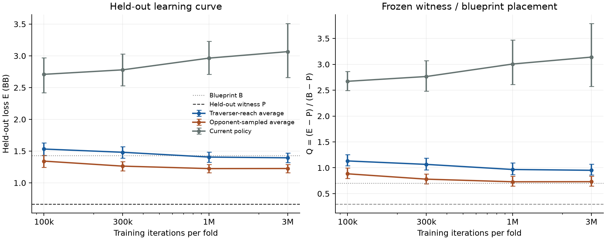

# HU20 trainer bench

The [frozen protocol](../hu20-trainer-bench-protocol.md) tested the production CFR rules densely on #149's turn roots with frozen ranges. Both held-out folds reached 3,000,000 iterations; all 40 held-out roots scored all 12 checkpoint/strategy policies in one native pass each.

**Frozen primary outcome: CFR's v1 fixed point is poor even with dense training.** At 3M the production traverser-reach average has E=1.3942 [1.3191, 1.4718] BB and Q=0.9514 [0.8590, 1.0722]. The opponent-sampled average has Q=0.7308 [0.6442, 0.8399]. Classification uses the protocol's point-estimate thresholds; the current policy is reported and does not classify the run.

Both averages remain in the protocol's near-blueprint region despite dense fixed-range training. Opponent-sampled averaging lowers E by 0.1686 BB relative to the production average, but does not meet the averaging-defect condition (Q <=0.3); its Q interval crosses 0.7. The frozen rule identifies a poor CFR fixed point in v1 at this budget.

**Next 0.4.x trainer step:** Bring a measured comparison of abstraction-aware training (CFR-BR or asymmetric abstraction) and a better abstraction before choosing the next 0.4.x trainer change.

## Learning curve

E is the mean loss over the paired held-out boards. Q=(E−P)/(B−P). Intervals use the frozen 2,000-draw paired board bootstrap, seed 202610050002; neither seats nor policies are treated as independent boards.

| Iterations | Strategy | E, BB [95% interval] | Q [95% interval] |
| ---: | --- | ---: | ---: |
| 100,000 | Traverser-reach average | 1.5323 [1.4301, 1.6306] | 1.1321 [1.0384, 1.2520] |
| 100,000 | Opponent-sampled average | 1.3422 [1.2455, 1.4350] | 0.8834 [0.7919, 0.9996] |
| 100,000 | Current policy | 2.7090 [2.4191, 2.9693] | 2.6717 [2.4947, 2.8612] |
| 300,000 | Traverser-reach average | 1.4814 [1.3920, 1.5677] | 1.0655 [0.9584, 1.1844] |
| 300,000 | Opponent-sampled average | 1.2632 [1.1873, 1.3361] | 0.7801 [0.6922, 0.8808] |
| 300,000 | Current policy | 2.7796 [2.5280, 3.0297] | 2.7641 [2.4808, 3.0710] |
| 1,000,000 | Traverser-reach average | 1.4060 [1.3254, 1.4836] | 0.9669 [0.8704, 1.0921] |
| 1,000,000 | Opponent-sampled average | 1.2244 [1.1616, 1.2884] | 0.7293 [0.6441, 0.8372] |
| 1,000,000 | Current policy | 2.9644 [2.7102, 3.2289] | 3.0058 [2.6112, 3.4714] |
| 3,000,000 | Traverser-reach average | 1.3942 [1.3191, 1.4718] | 0.9514 [0.8590, 1.0722] |
| 3,000,000 | Opponent-sampled average | 1.2256 [1.1601, 1.2921] | 0.7308 [0.6442, 0.8399] |
| 3,000,000 | Current policy | 3.0664 [2.6587, 3.5098] | 3.1394 [2.5760, 3.7894] |

The matching #149 references for lineage B500M seed 2026093001 are:

| Reference | Strategy | E, BB [95% interval] |
| --- | --- | ---: |
| B | Blueprint | 1.4313 [1.3212, 1.5364] |
| L | Per-root witness | 0.4733 [0.4345, 0.5110] |
| P | Held-out witness | 0.6670 [0.6390, 0.6973] |

The paired 3M minus 1M changes in E are descriptive learning-curve readouts, not additional classification criteria:

- Traverser-reach average: -0.0118 [-0.0417, 0.0177] BB.
- Opponent-sampled average: 0.0012 [-0.0139, 0.0152] BB.
- Current policy: 0.1021 [-0.3372, 0.5509] BB.

Both average curves change little between 1M and 3M, with paired change intervals spanning zero. This supports the frozen finite-budget reading and does not prove asymptotic convergence.

## Execution and evidence

Training used the unchanged runtime commit `74ba3202396128a3823b654d05d0b002b3c4ceed` (fold 0: 3.304 h, 77,055 keys; fold 1: 3.271 h, 74,317 keys). Native evaluation used 2.213 h summed pass time, with peak owned-family RSS 4.636 GiB against the 7 GiB ceiling. Minimum free disk observed by the 30-minute watcher was 29.65 GiB, above the 20 GiB floor. No bench relaunch, native failure or resource breach occurred. Paid compute: $0. PR #162 remains draft.

[Summary](hu20-trainer-bench-artifacts/summary.json), [independent bootstrap verification](hu20-trainer-bench-artifacts/independent-summary-verification.json), [raw metric/hash verification](hu20-trainer-bench-artifacts/RAW-VERIFICATION.json), [archive receipt](hu20-trainer-bench-artifacts/ARCHIVE-RECEIPT.json), [M1 retrieval receipt](hu20-trainer-bench-artifacts/retrieval.json), and [native Drive staging receipt](hu20-trainer-bench-artifacts/drive-staging.json) retain the complete values and provenance. Raw evidence is staged as one whole archive at `PR-162-HU20-trainer-bench/M4-run-20261005/` in the [designated research Drive folder](https://drive.google.com/drive/folders/188bEt6i0RHqegCCdvpf3wPzUiRw78N2s), including smoke evidence, every checkpoint, recovery state, logs, inputs and source. Archive size: 1,745,796,815 bytes; SHA256 `67d51196af43202d6e2ebff5222ccfd6a264c1d9d0eb4efdc7ccfa1fa78d3dd3`. The first archival staging attempt had a relative-path lookup error; its partial directory and error log are retained in the archive. Cloud upload completion is pending; M4 originals remain retained. See [RESULTS_INDEX](../../RESULTS_INDEX.md) for restoration locations.

This isolates turn/river learning on one public line, one lineage, fixed ranges and 20 training boards per fold. The witnesses are feasible constructions, and the full game pools more boards per key. The result does not establish full-game playing strength.
