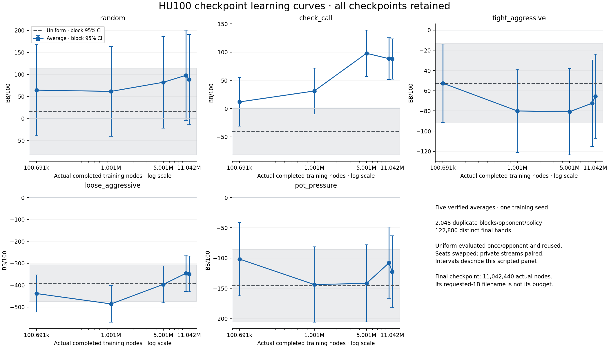
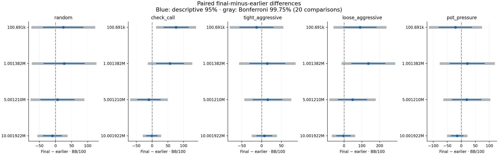
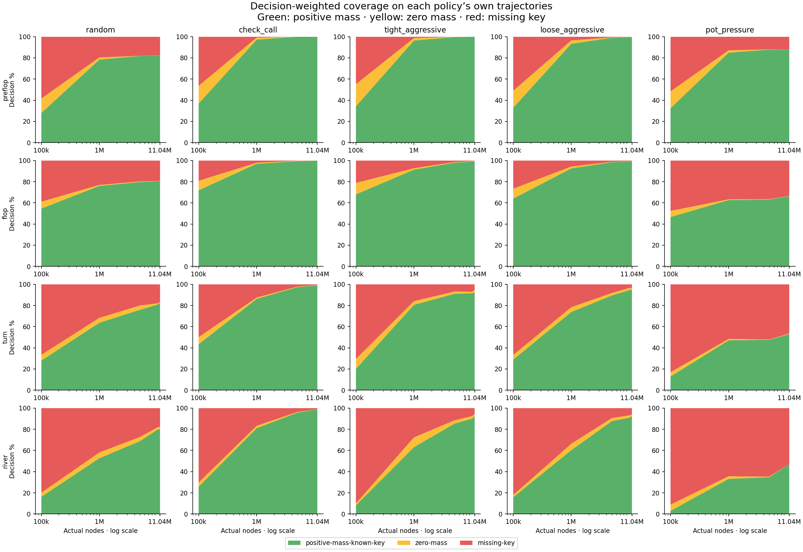

# HU100 learning curves: better coverage, uneven playing gains

**All five checkpoint results are retained.** Across 122,880 distinct final hands,
positive-mass lookup coverage rises broadly, but playing gains are uneven. The
11,042,440-node average improves over the 100,691-node average against check_call
in the sole comparison that clears the predeclared 20-comparison adjustment.
The other 19 comparisons are inconclusive. Every checkpoint loses to all three
aggressive opponents in this sample. No final-versus-10M gain is detected on any
opponent; this budget does not prove a plateau or absence of further learning.
No checkpoint is selected and no model, training or release change follows.

[PR #200](https://github.com/dberweger2017/deepcfr-texas-no-limit-holdem-6-players/pull/200)
· [protocol](../native-hu100-learning-curves.md)
· [configuration and complete model pins](../../configs/arena/hu100-learning-curves-v1.json)
· [machine summary](native-hu100-learning-curves-artifacts/scientific-summary.json).

## Complete descriptive curves

Fixed heads-up 100-BB stacks reset each hand, blinds 50/100, no rake. Opponents
are #197's unchanged random, check_call, tight_aggressive, loose_aggressive and
pot_pressure; random retains its distinct minimum-raise/all-in behavior. Uniform
is uniform over the identical native HU100 menu, using the unchanged sampler.
All policies share one fresh physical schedule per opponent with swapped seats.

**2,048 independent duplicate blocks/opponent/policy** were frozen from a separate
16-block cost-only pilot. Each policy has 4,096 hands/opponent. Five checkpoint
policies plus uniform yield 122,880 distinct final hands; the pilot's 960 hands are
excluded. Student-t 95% intervals below average the two seats within each block.
They are descriptive and unadjusted. Uniform was evaluated exactly once per
opponent and its exact actions/settlements reused across every checkpoint.

[Vector SVG](native-hu100-learning-curves-artifacts/learning-curves.svg)
· [Exportable CSV](native-hu100-learning-curves-artifacts/learning-curves.csv).
The horizontal gray reference and its band represent the same single uniform
sample on every checkpoint. Lines connect observed points without establishing
monotonicity. X is actual completed nodes on a log scale; 10M and 11.04M are close.

| Actual completed nodes | random | check_call | tight_aggressive | loose_aggressive | pot_pressure |
| ---: | ---: | ---: | ---: | ---: | ---: |
| 100,691 | +64.25 [-39.36, +167.85] | +11.88 [-31.29, +55.04] | -52.55 [-91.29, -13.81] | -438.43 [-522.99, -353.87] | -101.79 [-162.25, -41.34] |
| 1,001,382 | +61.52 [-40.65, +163.69] | +31.15 [-9.34, +71.65] | -80.08 [-121.28, -38.88] | -485.77 [-569.56, -401.97] | -143.79 [-206.13, -81.44] |
| 5,001,210 | +82.21 [-21.89, +186.31] | +97.90 [+56.83, +138.97] | -80.82 [-123.56, -38.08] | -396.48 [-480.42, -312.55] | -141.86 [-205.53, -78.19] |
| 10,001,922 | +97.97 [-4.86, +200.81] | +88.35 [+51.37, +125.34] | -72.40 [-115.20, -29.60] | -346.04 [-428.44, -263.65] | -107.98 [-167.21, -48.75] |
| 11,042,440 | +88.28 [-14.00, +190.56] | +87.78 [+51.87, +123.69] | -65.47 [-107.11, -23.82] | -349.12 [-430.57, -267.67] | -122.68 [-182.07, -63.29] |
| Uniform reference | +15.80 [-82.85, +114.44] | -40.37 [-81.95, +1.22] | -52.51 [-91.99, -13.03] | -391.21 [-475.14, -307.28] | -145.64 [-205.55, -85.73] |

BB/100 [descriptive block 95% CI]. The five actual budgets are **100,691;
1,001,382; 5,001,210; 10,001,922; 11,042,440 nodes**, all the same training seed
2026100601. Indexed average SHA256, byte size, iteration, entries and source
checkpoint SHA256 were verified on retrieval/loading/snapshot. Completed-node
headers match the model index. The capacity checkpoint's requested-1B filename
is **not** a 1B completion; no 1B milestone exists in this lineage.

Final versus uniform is +72.49 [−68.33, +213.30] against random,
+128.15 [+74.66, +181.63] against check_call,
−12.95 [−64.65, +38.74] against tight_aggressive,
+42.09 [−60.16, +144.34] against loose_aggressive and
+22.96 [−50.72, +96.65] against pot_pressure. Only check_call clears zero in these
unadjusted descriptive differences. This fresh sample differs from #197's earlier
baseline; the old baseline was not reused as the new uniform reference or enlarged
into this evaluation. Both earlier losses and that baseline remain preserved.

## Predeclared paired final-minus-earlier comparisons

The formal family is exactly four earlier checkpoints ×five opponents =**20**
paired comparisons. Bonferroni FWER 0.05 uses two-sided alpha 0.0025 /**99.75%**
Student-t intervals. Paired block differences preserve deal, seat and private
stream pairing. Ordinary paired 95% intervals are also retained as descriptive.
No selection, omnibus or post hoc monotonicity test replaces this family.

[Vector SVG](native-hu100-learning-curves-artifacts/paired-differences.svg)
· [Exportable CSV](native-hu100-learning-curves-artifacts/paired-differences.csv).

| Opponent | Earlier actual nodes | Final − earlier BB/100 [95%] | Bonferroni 99.75% interval | Formal label |
| --- | ---: | ---: | ---: | --- |
| random | 100,691 | +24.04 [-37.61, +85.68] | [-71.12, +119.19] | inconclusive |
| check_call | 100,691 | +75.90 [+37.61, +114.20] | [+16.79, +135.01] | improvement |
| tight_aggressive | 100,691 | -12.92 [-54.65, +28.82] | [-77.33, +51.50] | inconclusive |
| loose_aggressive | 100,691 | +89.31 [-2.43, +181.05] | [-52.30, +230.91] | inconclusive |
| pot_pressure | 100,691 | -20.89 [-78.99, +37.22] | [-110.58, +68.81] | inconclusive |
| random | 1,001,382 | +26.76 [-35.72, +89.24] | [-69.69, +123.20] | inconclusive |
| check_call | 1,001,382 | +56.63 [+13.58, +99.68] | [-9.82, +123.08] | inconclusive |
| tight_aggressive | 1,001,382 | +14.61 [-29.58, +58.80] | [-53.60, +82.82] | inconclusive |
| loose_aggressive | 1,001,382 | +136.65 [+43.79, +229.50] | [-6.69, +279.98] | inconclusive |
| pot_pressure | 1,001,382 | +21.11 [-39.57, +81.78] | [-72.55, +114.76] | inconclusive |
| random | 5,001,210 | +6.07 [-45.57, +57.70] | [-73.63, +85.77] | inconclusive |
| check_call | 5,001,210 | -10.12 [-45.93, +25.69] | [-65.39, +45.15] | inconclusive |
| tight_aggressive | 5,001,210 | +15.36 [-21.08, +51.80] | [-40.89, +71.60] | inconclusive |
| loose_aggressive | 5,001,210 | +47.36 [-32.03, +126.76] | [-75.19, +169.91] | inconclusive |
| pot_pressure | 5,001,210 | +19.18 [-31.91, +70.27] | [-59.68, +98.04] | inconclusive |
| random | 10,001,922 | -9.69 [-37.58, +18.20] | [-52.74, +33.36] | inconclusive |
| check_call | 10,001,922 | -0.57 [-16.88, +15.73] | [-25.74, +24.60] | inconclusive |
| tight_aggressive | 10,001,922 | +6.93 [-11.61, +25.48] | [-21.69, +35.56] | inconclusive |
| loose_aggressive | 10,001,922 | -3.08 [-40.82, +34.67] | [-61.34, +55.19] | inconclusive |
| pot_pressure | 10,001,922 | -14.70 [-35.39, +5.99] | [-46.63, +17.24] | inconclusive |

The sole adjusted improvement is final minus 100k against check_call:
**+75.90 [+16.79, +135.01] BB/100**. No adjusted decline is detected; this does not
establish noninferiority. The final-versus-10M means are −9.69, −0.57, +6.93,
−3.08 and −14.70 BB/100 in the opponent order above; all adjusted intervals cross
zero. The curves are descriptive, not a claim of convergence or stronger poker.

## Coverage and aggressive-opponent losses

[Complete counts and rates for all 100 checkpoint/opponent/street cells](native-hu100-learning-curves-artifacts/coverage.csv)
include **positive-mass known key, zero mass and missing key**, with the observed
decision denominator. The machine summary preserves action rates and latency too.
Coverage is measured on each policy's own trajectories, so growing coverage and
profit can coexist without coverage causing the profit change. Sparse river
counts and changing trajectories limit cross-checkpoint interpretation.

[Vector SVG](native-hu100-learning-curves-artifacts/coverage.svg).
The green/yellow/red areas interpolate the five observed decision-rate points.
Uniform's cached lookup exposure refers only to the 100k model; it is excluded
from this candidate coverage comparison and never interpreted as uniform learning.

| Opponent | Street | Positive mass %: 100k → final | Final zero mass % | Final missing key % | Final decisions |
| --- | --- | ---: | ---: | ---: | ---: |
| random | preflop | 27.94 → 82.29 | 0.07 | 17.64 | 4,138 |
| random | flop | 54.58 → 81.09 | 0.08 | 18.83 | 1,195 |
| random | turn | 27.95 → 82.50 | 0.68 | 16.82 | 440 |
| random | river | 16.23 → 80.26 | 1.97 | 17.76 | 152 |
| check_call | preflop | 36.84 → 100.00 | 0.00 | 0.00 | 4,096 |
| check_call | flop | 71.85 → 99.86 | 0.06 | 0.09 | 3,485 |
| check_call | turn | 43.37 → 98.79 | 0.29 | 0.92 | 3,485 |
| check_call | river | 25.76 → 98.82 | 0.14 | 1.03 | 3,485 |
| tight_aggressive | preflop | 34.26 → 99.96 | 0.04 | 0.00 | 2,418 |
| tight_aggressive | flop | 68.00 → 99.19 | 0.54 | 0.27 | 742 |
| tight_aggressive | turn | 20.09 → 92.60 | 2.07 | 5.33 | 338 |
| tight_aggressive | river | 8.18 → 92.64 | 1.84 | 5.52 | 163 |
| loose_aggressive | preflop | 32.88 → 99.72 | 0.14 | 0.14 | 3,586 |
| loose_aggressive | flop | 64.00 → 99.27 | 0.12 | 0.61 | 1,633 |
| loose_aggressive | turn | 28.91 → 95.27 | 1.28 | 3.45 | 1,014 |
| loose_aggressive | river | 15.81 → 92.50 | 1.32 | 6.18 | 680 |
| pot_pressure | preflop | 32.44 → 87.79 | 0.14 | 12.07 | 2,932 |
| pot_pressure | flop | 46.62 → 66.36 | 0.23 | 33.41 | 874 |
| pot_pressure | turn | 12.88 → 53.37 | 0.52 | 46.11 | 386 |
| pot_pressure | river | 2.94 → 46.59 | 0.00 | 53.41 | 176 |

Check_call's improved profit accompanies preflop positive mass rising from 36.84%
to 100%, and river from 25.76% to 98.82%. Yet tight_aggressive coverage also becomes
high (99.96% preflop, 92.64% river) while the final policy still loses
**−65.47 [−107.11, −23.82] BB/100**. Better coverage is insufficient by itself.

Loose_aggressive's loss shrinks descriptively from −438.43 to −349.12 BB/100,
with a +89.31 paired difference from 100k; its adjusted interval [−52.30, +230.91]
is inconclusive. Its positive river rate grows 15.81%→92.50%, but the final loss
**−349.12 [−430.57, −267.67]** remains large. Tight_aggressive and pot_pressure
have larger losses at final than at 100k in point estimates (−12.92 and −20.89
paired changes), also inconclusive after adjustment. Against 1M, all three final
losses are descriptively smaller, but none of those adjusted differences clears
zero. No aggressive-opponent loss reduction is established by the formal family.

Pot_pressure remains the main coverage gap: final missing rates are **12.07%
preflop, 33.41% flop, 46.11% turn and 53.41% river** (176 river decisions). These
are lower than 100k, but its final profit is still **−122.68 [−182.07, −63.29]
BB/100**. Retaining positive-mass entries is not evidence that their strategy is
good, and missing-key fallback is not proof of reliable unseen-key play.

## Pairing, audits and deterministic reproduction

Pilot root **2026100820311**, final root **2026100820312**. The global final schedule
SHA256 is `2193f7b425f1f995bfa4d9ed88528b154b57654ea4244513684fae7022cc2a1c`;
count-freeze SHA256 `c95cfdb870dd3bfdbb7ba2bd9ddf31dd7e2e8e075925dd6e60af728dd25fec11`.
[Schedule freshness](native-hu100-learning-curves-artifacts/schedule-freshness.json)
verifies zero physical-deal intersections across both new stages and #197's two
old stages. Explicit deal/action coordinates remain in the raw archive.

Target and opponent private action seeds are paired **across checkpoints**, per
root/opponent/block/seat rotation/logical player, separately from uniform's arm.
Each hand resets its private streams. Divergent trajectories consume different
numbers of draws, pairing stream prefixes rather than semantic decisions. Seeds,
decks and evaluation schedules stay outside entitled player observations.
Telemetry runs after selection without consuming RNG; existing sampler/action
and RNG-state regressions pass. The uniform reference is sampled once/opponent;
its reproduced reference is also sampled once/opponent during deterministic replay.

Every final action/settlement independently replays, menus/keys/stream coordinates
validate, coverage/action rates recount, and all probabilities/classifications and
hands reproduce exactly (only measured latency is excluded). The independent
cross-checkpoint reporter verifies physical schedules, exact uniform-row reuse
and raw-chip block arithmetic. **122,880 distinct hands /477,296 actions** are
verified. Auditors replay **204,800 stored rows /801,836 actions**, including four
extra copies of the same uniform results; these copies are not new samples.
All 960 distinct pilot hands also passed replay and reproduction and remain
excluded from final estimates.

## Execution amendment, resources and source

The cost-only pilot retained the full count, with 2× allowance, measured fixed
cost 75.31 seconds, 0.15784 seconds/block for play/replay/reproduction, and a
240-second reserve. The quote predicted 797.13 seconds of final work with
1,713.73 seconds remaining. Neither pilot nor final poker outcomes were inspected
before freezing counts, or before the operational continuation below.

**The original launcher ended with a terminal fresh headroom-admission refusal.**
After 418.47 seconds, all four earlier checkpoints had completed play, replay and
reproduction; the last checkpoint's final panel had never started. Its original
failed state, traceback and incomplete guard receipt remain immutable. This was
a between-stage admission refusal, not a 10-GiB RSS breach. Sampled pressure was
normal; the exact failing admission snapshot was not saved, so its instantaneous
percentage/level is not claimed. The combined samples include a 72% system-free
reading, below the full 75% stage-admission headroom requirement, while live
hard pressure checks stayed normal. The host subsequently returned to 82%.

A **post-play operational protocol amendment** filled only the never-started last
panel. It preserved the original **10:37:26→11:07:26 UTC** absolute 30-minute
clock, source/model/opponent/menu, frozen count/deals/streams/comparisons and every
resource limit. It did not repeat passed science, retry partial play, change a
model, reset time or reinterpret the initial failure as success. Independent
source review and M4 import/read-only validation qualified the separate one-use
controller before its claim. Its original-root/source/config/freeze checks and
absence-of-fifth-output gates passed. The terminal admission refusal and this
execution deviation are retained; no claim of an uninterrupted, unchanged-launcher
campaign is made.

Initial scientific source: **`51597e88706465c33dc51577890989aa303fefca`**, also used
unchanged by all final/pilot adapters, auditor, reporter and model loads. Continuation
controller source: **`7a23843776a98331bb604ee2f1cdbb0473dca3d5`**, copied by exact
SHA256 `d7ab9e6cba5743356d54ef86ac069f1c9892368be64be1b6fb39ae7f6ae09641`
into ignored storage while the M4 checkout remained clean at the original source.
Plotting is later reporting code. [Source review](native-hu100-learning-curves-artifacts/source-review.json)
· [continuation review](native-hu100-learning-curves-artifacts/continuation-source-review.json)
· [M4 continuation qualification](native-hu100-learning-curves-artifacts/continuation-qualification.json).
The original source passed **60 focused M4 tests** and repository storage checks;
two continuation regressions passed independently. Initial launcher-routing and
preclaim controller import findings were fixed; a wrong qualification test filename
ran no tests and remains in `research/qualification/tests.log`.

All scientific work, including retrieval/loading, pilot, final play, all audits
and full reproduction, completed **10:53:52 UTC /985.81 seconds** from the original
start; both science guards closed by 986.16 seconds. The combined 103 sampled
resource readings show **0.938 GiB peak family RSS**, no swap growth (8 MiB below
original baseline), minimum free disk **85.991 GiB**, all AC/normal pressure,
minimum system free **72%**. RSS is sampled, not an exact transient peak.
The existing 10-GiB whole-family ceiling, unsafe-pressure/15%-free stop, original
448.81-MiB swap baseline/+0.5 GiB, 15.5-GiB disk and AC guards were not relaxed.
The separately guarded local archive/member verification and atomic cloud copy
finished **10:54:51 UTC**, within the same cap, with no archival guard failure.
No science remains active; permanent claims remain and no scheduler was created.

## Storage and limits

Independent [evidence review](native-hu100-learning-curves-artifacts/evidence-review.json)
passed at `a7c59a63a08c53e00b9af8d29318775833cc6915` with no actionable findings.
It checked all pins, curves, paired comparisons, coverage, plots, cap identities
and committed archive receipts; six regressions and repository artifact checks
passed. It did not download the raw archive or repeat M4 scientific replay.
Final-head CI is recorded by the PR's live checks, separately from this review.

The [accepted primary archive](https://drive.google.com/file/d/1aZ5HtPGEY0-qCtQkoJbbY122S6xxFISg/view)
in [PR200 Research-Cloud](https://drive.google.com/drive/folders/12azuxRTXRyEnpO-7tSb6TTOA4teHccMf)
is **1,224,575,891 bytes /910 locally verified members**, SHA256
`ac79cc76209e95c4dc1c4a6d6903b645fdae4aeec4fd0d7b7f2cf5603ced1139`.
Embedded `ARCHIVE-MANIFEST.json.gz` decompressed SHA256
`177c4eb37a5cfe10f9d940d4a81599e6ec3e6ca560e0cae7755c42adb83cfdd9`,
compressed member SHA256
`83a3b9672b02b4bd250d5e73f5d0b37f818e1bc16e06b408f5d1524abd79d0f3`.
Every member size/SHA256 and local native copy verify. Native uploaded/no-pending/
no-conflicts and independent connector ID/name/size/parent agree; remote archive
bytes were **not** downloaded. [Local receipt](native-hu100-learning-curves-artifacts/archive-local-receipt.json)
· [upload acceptance](native-hu100-learning-curves-artifacts/archive-upload-acceptance.json)
· [restoration index](../../RESULTS_INDEX.md).

The archive preserves all five exact averages/snapshots, source tar, environment,
retrieval provenance, frozen schedule, pilot, final/cached rows, private action maps,
reproduction, all audits, original refusal and continuation controller/claims/guards.
The later report/plots, archive acceptance and review/CI closeout are separate
metadata; the primary scientific ZIP stays immutable. Original PR197 archives and
all local originals are retained. No model or raw trace enters Git.

The accepted [metadata closeout ZIP](https://drive.google.com/file/d/1ZiaxnPine9S53FI9tOpipmxYP8sL6GIq/view)
contains the report, exportable plots/CSVs, compact scientific receipts, reviews,
retrieval index, upload acceptance and a dated pre-final CI snapshot: **587,007
bytes /31 verified members**, SHA256
`ec5304e8e6d75318f673bb4717efac56b4331233eaec3e495642d9a02776a23f`;
embedded `ARCHIVE-MANIFEST.json` SHA256
`feb80cc8acc725231a6e3602165f4004c2c2c0413242b418dac49f50cbc73133`.
All members and the atomic native copy verified; native upload and independent
connector metadata agree. This small metadata operation happened after the
completed scientific cap and restarted no scientific work. Final-head CI remains
the PR's live checks, not the earlier snapshot. [Receipt](native-hu100-learning-curves-artifacts/closeout-archive-local-receipt.json)
· [acceptance](native-hu100-learning-curves-artifacts/closeout-archive-upload-acceptance.json).

One training seed, one evaluation root, scripted opponents, wide intervals and
policy-dependent coverage constrain interpretation. There is no external benchmark,
LBR, exploitability, multi-seed, release or checkpoint-selection claim. These
results do not establish a stronger general poker policy. The PR is handed back
for owner review **without merging**.
