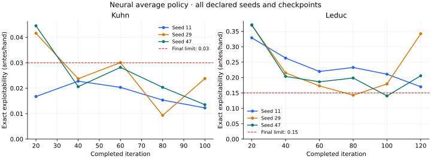

# Neural convergence and resume validation

## Declared protocol

Commit this protocol and both `neural-*-convergence-v1.json` configurations before running their training seeds. These checks complete roadmap milestone 3 only if every declared seed passes. The prior single-seed pilots and frozen-replay diagnosis remain separate results.

### Acceptance runs

| Game | Seeds | Iterations | Traversals per player/update | Advantage steps per update | Strategy steps per evaluation | Reservoir capacity | Final exploitability limit | Final value-error limit |
| --- | --- | ---: | ---: | ---: | ---: | ---: | ---: | ---: |
| Kuhn | 11, 29, 47 | 100 | 1,024 | 1,000 | 6,000 | 100,000 | 0.03 | 0.03 |
| Leduc | 11, 29, 47 | 120 | 1,024 | 4,000 | 6,000 | 200,000 | 0.15 | 0.10 |

All runs use the existing two-hidden-layer network, hidden size 64, batch size 256, Adam 0.001, alternating updates, uniform reservoirs, and iteration-weighted losses. Evaluate every 20 iterations and at the declared final iteration. Keep the initial policy convention and sampling method unchanged. The greater advantage fitting budget follows the previous frozen-replay diagnosis; it was not chosen from these new seeds.

Exploitability is half NashConv, in antes per hand, evaluated using exact information-set best responses to the **actual neural average policy**. Value error is the absolute difference between its first-player value and the independently solved equilibrium value. The limits match the earlier sampled tabular reference's acceptance limits. They establish a small-game convergence gate, not optimal play or a six-player strength guarantee.

Every seed must meet both limits at the final iteration. Do not select intermediate checkpoints, omit failed seeds, pool results to rescue a failed seed, extend budgets, or relax thresholds after viewing results. Report each seed, the mean, sample standard deviation, and range. These are three training seeds, not a precise estimate of all possible training outcomes.

### Reference and diagnostics

Pin `docs/reports/tabular-validation.json` by SHA-256 in both campaign configurations. Check that its underlying solver/game/evaluation source files still match the retained reference. Recompute the sequence-form equilibrium for each game and require primal/dual agreement, constraint residuals, exact exploitability, and agreement with the stored equilibrium value within 1e-8.

Compare neural results with the full-tree and external-sampling tabular results already retained in that report. This is a correctness/convergence comparison, not a paired-seed or equal-compute race. The tabular solvers use simultaneous updates, uniform iteration averaging, exact strategy tables, and different traversal/iteration budgets; the neural implementation uses alternating updates and linear weighting. Do not infer relative large-game efficiency from toy-game timings.

Retain all scheduled neural, empirical-memory, and exact-played-average evaluations, every advantage fit, final strategy fitting error, sample-noise MSE, replay coverage/counts, artifact hashes, and runtime/source/configuration fingerprints. Explain failures using those diagnostics without replacing the measured playing policy with a diagnostic table.

### Resume and resource limits

First require tests of complete replay/RNG restoration on Kuhn and Leduc, actual reservoir replacement, fresh-process CLI resume, byte-identical final inference files, and equality of every deterministic report field. Simulate an interrupted update and verify recovery uses the last completed snapshot. Check hash/contract mismatch rejection, preserved elapsed budget, and atomic publication without overwriting old snapshots.

During the Leduc seed-11 campaign, stop at iteration 60 and continue in a new process from its saved state. Retain the paused bundle and resumed bundle. The saved budget carries forward; this split does not permit additional iterations, optimizer steps, or a new seed. Exact uninterrupted/resumed equivalence is checked by the short regression scenarios, rather than claiming that this one split alone proves it at campaign scale.

Run each seed as a separate sequential local CPU job, with one Torch thread and an 800-second training budget (40 seconds of margin under the 840-second command target). Maximum declared training allocation is 4,800 seconds across six seeds; this is six bounded jobs, never concurrent. The iteration-60 split shares seed 11's original budget. Stop on invalid states, non-finite values, contract changes, or exhaustion. Retain a failure/timeout and continue the other predeclared seeds; no paid compute or GPU rental.

Snapshots are written at scheduled evaluation boundaries and explicit stops. Keep immutable files and a pointer to the last fully published snapshot. Interrupted work after that snapshot must be repeated. Recorded elapsed compute through the snapshot carries forward; work lost to an abrupt process kill cannot be recovered from that file. Keep the original failed attempt for accounting. This implementation resumes between completed iterations, not halfway through an optimizer fit.

## Follow-up declared after Leduc seed 11

Seed 11 completed 120 iterations with neural exploitability **0.169868**, above the 0.15 limit. The empirical strategy-memory average was **0.145379** and the exact played average **0.137689**. Final strategy fitting excess MSE was **0.004197**, with 287 of 288 information sets represented in its retained strategy replay. Keep this campaign result as failed.

Before running any refits, declare a separate diagnostic on that seed's final **frozen strategy memory**. Use `neural-strategy-refit-v1.json`: fit hidden sizes 64 and 128 for 24,000 steps each, preserving the original learning rate, batch size, iteration weighting, initialization seed, and minibatch stream. The 64-wide fit isolates additional optimizer steps; the 128-wide fit also changes capacity. Check the loaded baseline against the retained evaluation and hash replay before/after. Record both excess MSE and exact exploitability, including whether each reaches the original seed's 0.15 limit.

This is a diagnosis on the first declared Leduc seed, not a new convergence campaign or a model promotion. There is no best-checkpoint selection, additional self-play, policy export, or change to the original seed's assessment. A result below the limit would motivate a separately declared multi-seed confirmation, not retrospectively pass this campaign. Retain both refits whether they help or hurt. Run the diagnostic once, sequentially after the acceptance seeds, with a 180-second CPU limit and no paid compute.

## Results — 15 September 2026

**Kuhn passes; Leduc fails. Milestone 3 remains open.** All six declared runs finished within their original iteration and time limits. Every value-error check passed, but all three Leduc neural policies missed the exploitability limit. No threshold, seed, or final-iteration choice was changed.

The [machine-readable report](neural-convergence.json) retains campaign and training manifests, per-seed final results, tabular comparisons, the pause/resume evidence, and the frozen-strategy diagnosis. [Every scheduled evaluation](neural-convergence-curves.jsonl) and [every advantage fit](neural-convergence-advantage-fits.jsonl) is retained separately. Raw snapshots and inference files remain in ignored `results/neural-convergence-*`; their hashes are recorded, but those binaries are not part of a fresh checkout.

### Final acceptance results

| Game | Seed | Iterations | Neural exploitability | Limit | Value error | Limit | Result | Recorded training seconds |
| --- | ---: | ---: | ---: | ---: | ---: | ---: | --- | ---: |
| Kuhn | 11 | 100 | 0.012264 | 0.03 | 0.000965 | 0.03 | passed | 104.34 |
| Kuhn | 29 | 100 | 0.023792 | 0.03 | 0.000656 | 0.03 | passed | 106.43 |
| Kuhn | 47 | 100 | 0.013515 | 0.03 | 0.001468 | 0.03 | passed | 108.37 |
| Leduc | 11 | 120 | 0.169868 | 0.15 | 0.016494 | 0.10 | failed | 465.45 |
| Leduc | 29 | 120 | 0.342340 | 0.15 | 0.016324 | 0.10 | failed | 471.63 |
| Leduc | 47 | 120 | 0.205737 | 0.15 | 0.004084 | 0.10 | failed | 480.96 |

Kuhn mean exploitability was **0.016524**, sample standard deviation **0.006326**, range **0.012264–0.023792**. Leduc mean was **0.239315**, sample standard deviation **0.091007**, range **0.169868–0.342340**. These summaries do not override individual failures.

Recorded training time totals **1,737.19 seconds** (28.95 minutes) across six sequential jobs, including both portions of resumed seed 11. The longest seed took 480.96 seconds, below its 800-second budget. Oracle checks and reporting overhead are outside these training timings. No GPU rental or paid compute was used.

All six runs share the same training source fingerprint, recorded in `resume_validation`. They span revisions `376c377`, `dbe0015`, and `30e0903`; the intervening commits add documentation and the separate diagnostic script without changing acceptance training code. Dirty flags are retained where documentation was being written during the campaign. The diagnostic separately records its own script hash. The runtime was Python 3.11.15, NumPy 1.26.4, SciPy 1.17.1, and Torch 2.5.1 on the deterministic one-thread CPU path.

### Comparison with the tabular reference

| Game | Full-tree tabular exploitability | Sampled tabular range, seeds 7/19/43 | Neural range, seeds 11/29/47 |
| --- | ---: | ---: | ---: |
| Kuhn | 0.002318 | 0.003586–0.008222 | 0.012264–0.023792 |
| Leduc | 0.014454 | 0.064428–0.077651 | 0.169868–0.342340 |

The neural baseline is worse than the retained tabular reference on both games. Kuhn nevertheless satisfies its declared neural tolerance; Leduc does not. Different update/averaging conventions and budgets prevent interpreting this table as a paired-seed or equal-compute comparison. The independently recomputed equilibrium checks agree with the pinned reference within 1e-8.

### The Leduc strategy network loses useful accuracy

| Seed | Neural average | Empirical memory average | Exact played average | Strategy excess MSE | Retained information-set coverage |
| --- | ---: | ---: | ---: | ---: | ---: |
| 11 | 0.169868 | 0.145379 | 0.137689 | 0.004197 | 287/288 |
| 29 | 0.342340 | 0.135191 | 0.131736 | 0.006528 | 287/288 |
| 47 | 0.205737 | 0.139129 | 0.129678 | 0.002869 | 285/288 |

Both diagnostic averages fall below 0.15 for every final Leduc seed. The actual neural policy does not. Strategy fitting is therefore a concrete bottleneck in this campaign. The remaining error in the diagnostic averages and missing retained information sets also matter; this does not prove fitting is the only limitation.

Seed 29's neural exploitability was 0.142528 at iteration 80 and then deteriorated to 0.342340 at iteration 120. Seed 47 was 0.140274 at iteration 100 and finished at 0.205737. Selecting the best intermediate checkpoint would have concealed the instability. All three Leduc strategy memories retained 200,000 entries from roughly 1.68 million visits. Every final advantage and strategy reservoir in both games exercised replacement.

### Frozen-strategy diagnosis: more steps alone did not fix playing strength

The diagnostic reloaded seed 11's original iteration-120 policy and reproduced its evaluation exactly. The strategy replay hash stayed unchanged through both fits, and sample-noise MSE remained **0.160993**.

| Strategy hidden size | Optimizer steps | Excess MSE | Exploitability | Below 0.15? |
| --- | ---: | ---: | ---: | --- |
| 64, original | 6,000 | 0.004197 | 0.169868 | no |
| 64, refit | 24,000 | 0.001718 | 0.171770 | no |
| 128, refit | 24,000 | 0.000833 | 0.152001 | no |

The current network's longer fit reduced its weighted fitting loss but slightly worsened exploitability. More capacity improved the result, but **0.152001 still fails** the original 0.15 limit. These fits took 28.45 seconds together, below the declared 180-second cap. Neither result is a promoted model or a replacement campaign result.

This demonstrates why aggregate training loss alone is insufficient. The next change should examine fitting stability, errors on rare public histories, replay coverage, and the effects of batch size, learning rate, and model capacity. Use frozen-replay comparisons to choose a candidate before spending another full multi-seed campaign. Do not infer from these two fits that a wider network alone solves the problem.

### Recovery and implementation evidence

The local regression suite passes **260 tests**. New checks cover complete replay/RNG recovery in both games, reservoir replacement after restoration, fresh-process CLI continuation, byte-identical final policy exports, equality of all deterministic report fields, interrupted-update recovery, elapsed-budget preservation, hash/contract rejection, atomic snapshot publication, and campaign failure retention. CI also runs separate CLI processes for pause/resume and compares the resumed policy bytes with uninterrupted training.

The larger Leduc seed-11 run paused after iteration 60, retaining a strategy reservoir with 200,000 samples from 831,628 visits. A fresh process loaded that exact checkpoint hash and completed iteration 120. Its first three scheduled evaluations and first 120 advantage-fit records match the paused bundle exactly. The complete paused attempt is retained. This supplements the exact uninterrupted/resumed regression tests; the campaign itself was not trained a second time to claim full-run reproduction.

### Decision

Merge the recovery/evaluation infrastructure and retain this failed convergence campaign as the baseline. Keep milestone 3 open. The next PR should stabilize average-strategy fitting and address relevant replay-coverage weaknesses, then declare a fresh multi-seed confirmation with the same exploitability/value tolerances. Do not move the learning rewrite into no-limit Hold'em or rent substantial training compute on the strength of these results.
