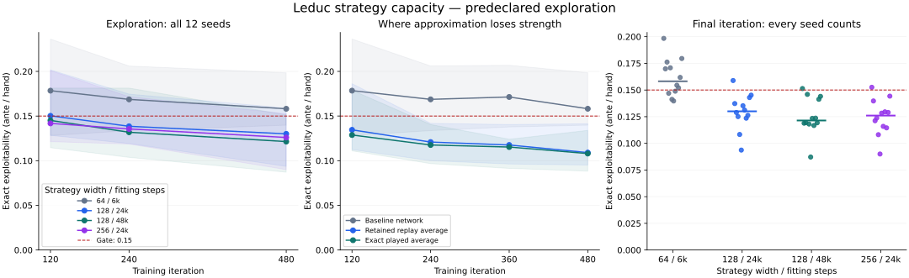

# Strategy capacity: results

**Wider strategy networks improve all twelve final Leduc results, but no recipe
passes the predeclared all-seed gate. Milestone 3 remains open.** The strongest
worst-seed result is 0.151373 against the unchanged 0.15 limit. Confirmation was
not started, and its eight seeds remain unused. No model was promoted.

Date: September 15, 2026. [PR #50](https://github.com/dberweger2017/deepcfr-texas-no-limit-holdem-6-players/pull/50).
See the [protocol](../strategy-capacity-study.md),
[frozen configuration](../../configs/solver/strategy-capacity-v1.json),
[complete compact results](strategy-capacity.json), and
[all advantage-fitting diagnostics](strategy-capacity-advantage-fits.jsonl).

## What changed and what was tested

The strategy network now has its own hidden width, independent of the advantage
networks. Checkpoint recovery and inference loading preserve those different
widths. Strategy fitting has an independent random stream and does not affect
traversal or advantage learning. Tests compare replay contents, random states,
advantage weights, and fresh end-to-end results to verify that property.

Twelve new seeds each collected 480 iterations with the same advantage recipe:
width 64, 1,024 traversals per player/update, 4,000 fitting steps, batch size 256,
learning rate 0.001, and 200,000 samples per reservoir. Four strategy recipes were
compared on each saved reservoir at iterations 120, 240, and 480. This retains
**144 outcomes** from twelve independent collection trajectories. The four fits
within a seed are paired comparisons, not independent training seeds.

Selection was restricted to iteration 480. Every exploration seed had to satisfy
both exact exploitability at most 0.15 ante units per hand and absolute game-value
error at most 0.10. The winner would minimize the worst-seed exploitability, then
the mean. Settings, seeds, thresholds, and selection rules were committed before
execution and remained unchanged. Earlier checkpoints cannot rescue a failed
final result.

## Final results: every seed

Exact exploitability, in ante units per hand; lower is better. Width/steps refer
to the strategy network. All four recipes satisfy the value-error limit on every
seed; exploitability is the failed condition.

| Seed | Baseline 64 / 6k | Wider 128 / 24k | Longer fit 128 / 48k | Largest 256 / 24k |
| --- | ---: | ---: | ---: | ---: |
| 211 | 0.198428 | 0.158895 | 0.151373 | 0.152558 |
| 223 | 0.169882 | 0.137290 | 0.118899 | 0.139746 |
| 227 | 0.176202 | 0.128918 | 0.119411 | 0.121199 |
| 229 | 0.146960 | 0.125104 | 0.145916 | 0.123760 |
| 233 | 0.170832 | 0.108321 | 0.118096 | 0.108127 |
| 239 | 0.141217 | 0.093687 | 0.087157 | 0.090008 |
| 241 | 0.139730 | 0.135261 | 0.123427 | 0.128289 |
| 251 | 0.148907 | 0.131197 | 0.116734 | 0.115926 |
| 257 | 0.154477 | 0.123593 | 0.123631 | 0.129532 |
| 263 | 0.151997 | 0.126239 | 0.119275 | 0.114523 |
| 269 | 0.161823 | 0.142953 | 0.141317 | 0.128938 |
| 271 | 0.179546 | 0.145183 | 0.144030 | 0.144273 |
| **Mean** | **0.161667** | **0.129720** | **0.125772** | **0.124740** |
| **Worst** | **0.198428** | **0.158895** | **0.151373** | **0.152558** |
| **Passing seeds** | **4/12** | **11/12** | **11/12** | **11/12** |

Seed 211 fails with every recipe. The 128/48k result misses by 0.001373; the
256/24k result misses by 0.002558. Those margins are small, but changing the
threshold after seeing them would invalidate the acceptance decision. The exact
best-response evaluation has no Monte Carlo measurement uncertainty here;
training-seed variation and the finite experiment budget remain important.

Relative to the paired baseline, all three alternative recipes improve all
twelve final results. The largest network reduces mean exploitability by about
23%, while the longer fit has the best worst-seed result. Neither is a qualifying
winner under the declared rule. All value errors are below 0.025, well inside
the 0.10 limit; complete per-seed values are in the JSON.

## Learning curves and remaining approximation error



Lines show medians and shaded bands show the observed minimum–maximum across
twelve seeds. These bands are not confidence intervals. The right panel shows
each final seed and the median. Middle-panel averages are diagnostics from the
small-game solver; they are not replacement inference models.

Each cell below gives **mean exploitability / passing seeds**:

| Iteration | Baseline 64 / 6k | Wider 128 / 24k | Longer fit 128 / 48k | Largest 256 / 24k |
| --- | ---: | ---: | ---: | ---: |
| 120 | 0.178762 / 3/12 | 0.154178 / 6/12 | 0.149129 / 7/12 | 0.149480 / 7/12 |
| 240 | 0.170522 / 3/12 | 0.140366 / 10/12 | 0.137536 / 8/12 | 0.138759 / 9/12 |
| 480 | 0.161667 / 4/12 | 0.129720 / 11/12 | 0.125772 / 11/12 | 0.124740 / 11/12 |

Longer collection helps, but the baseline network still averages 0.161667 at
iteration 480. At that same checkpoint:

| Strategy representation | Mean exploitability | Worst seed |
| --- | ---: | ---: |
| Exact played average | 0.107020 | 0.133944 |
| Average reconstructed from retained replay | 0.112195 | 0.141322 |
| Baseline strategy network | 0.161667 | 0.198428 |
| Best worst-seed network recipe, 128 / 48k | 0.125772 | 0.151373 |

Every exact played average and replay average is below 0.15. For seed 211,
those two diagnostics are 0.133944 and 0.141322, while its best neural fit is
0.151373. This is evidence that the remaining acceptance failure includes loss
of playing strength when fitting the strategy network. It does not prove that
collection, replay, or coverage can be ignored, or that more capacity will
necessarily solve the problem.

Final replay coverage ranges from 283 to 287 of 288 information sets. A missing
information set is a player-visible decision situation absent from the retained
samples. The replay diagnostic uses the existing documented fallback for absent
targets; its passing result does not establish adequate learned behavior there.
All coverage counts and training snapshots are retained for the next diagnosis.

Mean replay-weighted excess MSE falls from 0.003446 for the baseline to 0.001188,
0.000721, and 0.000976 for the three alternatives. The smallest MSE and the lowest
mean exploitability occur with different recipes. Fitting error is useful for
diagnosis, but playing-strength evaluation remains the selection criterion.

## Hardware, throughput, and provenance

| Item | Result |
| --- | --- |
| Rental | Runpod EUR-IS-1; AMD EPYC 4564P, 16 physical cores / 32 logical CPUs |
| Allocation | 32 vCPUs, 64,000,000,000-byte memory limit; CPU affinity 0–31 |
| Disk | 20 GB temporary disk; no persistent or network volume |
| Runtime | Python 3.11.15, Torch 2.5.1+cpu, NumPy 1.26.4, SciPy 1.17.1 |
| Training source | `3856e1b10ff69ac5351890e265c535af1146ce18`, clean checkout |
| Representative 24-iteration job | 106.56 seconds |
| Sixteen short jobs with 4 / 8 / 16 workers | 89.68 / 46.50 / 25.19 seconds |
| Calibration total | 267.96 seconds |
| Chosen worker limit | 16; all twelve exploration seeds ran together |
| Actual collection time per seed | 2,256–2,330 seconds, about 38–39 minutes |
| Exploration including all refits | 2,625.93 seconds, about 44 minutes |

All calibration worker counts produced identical non-timing training reports and
exported policy hashes. Sixteen workers completed the fixed batch 3.56 times as
fast as four workers. This is an ordered throughput check on one host, not a
statistical hardware comparison or a guarantee for full Hold'em workloads.
Each worker used one Torch/BLAS thread. The full study completed without a failed
worker, timeout, invalid state, missing seed, or omitted fit.

The compact report retains the source/configuration fingerprints, environment,
full dependency listing, allocation, all evaluation curves, fitting metrics,
policy hashes, and input-checkpoint hashes. The independent equilibrium checks
matched the retained tabular reference before training each seed.

## Cost and cleanup

The quote was $1.12/hour for compute plus $0.003/hour for temporary disk. The pod
was provisioned after 15:01:13 UTC, verified stopped and terminated before 16:04 UTC. The conservative elapsed-time estimate at the quoted
rate is **at most about $1.18**, excluding any provider billing adjustments.
The displayed balance moved from $10.83 to $9.74; that $1.09 change is rounded
and may lag settlement. It is not an exact invoice. Including the earlier pilot,
roughly $1.22 of the $10 CPU authorization covers the conservative quoted-rate
estimate. GPU funding was not used.

All artifacts were copied and verified before shutdown. The stopped pod showed
$0.00/hour for compute and storage; termination then removed its configuration.
No persistent or network volume was allocated, and no billable storage remains.
The scheduled follow-up allowed the active assistant session to pause during
training. There is no ongoing rental or additional experiment from this PR.

The full archive SHA-256 matched remotely and locally:

```text
145fc401314bfa5f1a187d6fd8afccb59014dfc0647cc7a49f8e64b2610349b8
```

Raw artifacts are retained on the owner's workstation at
`results/strategy-capacity-remote-v1.tar.gz` and the extracted
`results/strategy-capacity-remote-v1/`, excluded from Git. The extracted folder
contains calibration, all twelve exploration bundles, and runtime allocation.
Request that archive from the owner to inspect the original replay/snapshots;
there is no public checkpoint download. Reproduction starts from the pinned
training commit, configuration, and recorded CPU runtime using the commands in
the protocol. Cross-platform bitwise reproduction is not claimed.

## Decision and next PR

**Do not start milestone 4 yet.** Keep the original failures and this unsuccessful
campaign in the record. The fresh confirmation seeds were not consumed in either
Leduc or Kuhn, so the earlier Kuhn results remain the only completed Kuhn gate.

The next task is to diagnose the remaining strategy-fitting error from these
retained snapshots: inspect errors and sample weights by information set,
including missing and rarely sampled situations, and distinguish optimization
error from representation/coverage limits. Use the full replay-weighted objective
as a diagnostic alongside minibatch fitting; do not silently change the target
weights or substitute a tabular policy for the neural model. That evidence should
determine the next bounded fitting change. Freeze its recipe before a new
all-seed confirmation with the original limits. Increasing training time or
network width again without that diagnosis is not the next step.

This study supports an implementation and learning diagnosis in two-player
Leduc. It establishes neither professional Hold'em strength nor a multiplayer
convergence guarantee. The 1.0 release standard remains unchanged.

## Validation

- 271 local tests passed, including unequal-width inference/recovery,
  fresh-process resume, collection independence, shared-versus-fresh fitting,
  selection completeness, and confirmation with separate seeds.
- GitHub's Linux test job passed before the campaign. Source remained frozen
  throughout calibration and exploration.
- All 144 planned outcomes and all twelve complete collection trajectories were
  retained; no recipe qualified, and confirmation was correctly skipped.
- Archive and checkpoint hashes verified after retrieval. Plot and report values
  were checked against the retained outputs. No trained model was promoted.
