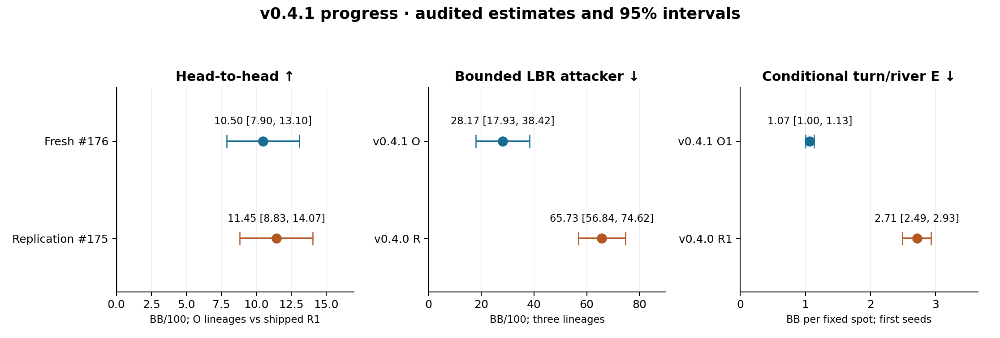

# v0.4.0 → v0.4.1

O is the owner-selected v0.4.1 model, pending the final release go in chat. This is a two-player, 20-BB, no-rake research bot. It beats the incumbent in the tested direct matches and reduces two bounded weakness probes. It is still exploitable; these measurements do not certify full-game Nash equilibrium or human playing strength.

The release preserves #165's exact 1B-node linear-CFR opponent-sampled average, seed **2026100601**, SHA256 `571e198266eabc6d8bb9de2d1aa76d9a68be0b2512222ea96874168989c6b74d`, **142,677,367 bytes**. Missing keys and retained zero-mass keys keep their evaluated uniform fallback. The current-policy zero-mass option is not used. v0.4.0 remains available.

## Is it better against v0.4.0?

The fresh #176 direct match is **+10.50 [7.90, 13.10] BB/100** for the three O lineages against the shipped v0.4.0 R1. Every lineage individually beats R1; the shipped first seed's result is **+11.12 [7.85, 14.39]**. These are nominal paired 95% Student-t intervals over duplicate deal blocks, with seats swapped and lineages averaged inside each block. They condition on the retained policies rather than sampling new training seeds. [Audited #176 results](https://github.com/dberweger2017/deepcfr-texas-no-limit-holdem-6-players/pull/176#issuecomment-6015710190).

| Direct O seed vs shipped R1 | Duplicate blocks | O−R1, BB/100 (95% CI) | Label |
| --- | ---: | --- | --- |
| 2026100601 | 49,152 | +11.12 [+7.85, +14.39] | better |
| 2026100602 | 49,152 | +10.80 [+7.53, +14.07] | better |
| 2026100603 | 49,152 | +9.59 [+6.34, +12.84] | better |

An earlier independent fresh-root match in #175 measured **+11.45 [8.83, 14.07] BB/100**, also averaging the three exact O policies against R1. This replication is reported separately, without pooling test roots or selecting the better estimate. [Audited #175 results](https://github.com/dberweger2017/deepcfr-texas-no-limit-holdem-6-players/pull/175#issuecomment-6013651710).

## How far from equilibrium? Lower is better

A **bounded local best response (LBR)** attacker earns **28.17 [17.93, 38.42] BB/100 against O**, versus **65.73 [56.84, 74.62] against the v0.4.0 R lineages**. These absolutes average three lineages and both seats. The paired O−R target-profit improvement is **+37.56 [27.75, 47.37]**. The attacker searches a limited menu and sampled future cards: its profit is a lower bound on exploitability, not the maximum a perfect full-game opponent could win. A smaller bounded-attacker return is a useful improvement, not proof of safety against every opponent. [Audited #176 panel results](https://github.com/dberweger2017/deepcfr-texas-no-limit-holdem-6-players/pull/176#issuecomment-6015710190).

On identical fixed turn/river spots, first-seed O's **E is 1.0665 [1.0023, 1.1315] BB per conditional spot**, versus shipped R1's **2.7147 [2.4922, 2.9323]**. **Q is 0.5226 [0.4807, 0.5768] versus 2.6792 [2.3247, 3.0578]**. The paired E change is **−1.6483 [−1.8563, −1.4479] BB**. Intervals use the same paired board-bootstrap draws. [Audited #176 turn/river results](https://github.com/dberweger2017/deepcfr-texas-no-limit-holdem-6-players/pull/176#issuecomment-6016045349).

E measures a perfect best response **within the retained turn/river tree and ranges**, above the approximate reference policy's value. It is not loss against a perfect full-game poker opponent. These are the same 40 boards, both seats, common B500M ranges, locked policies, binary and #149 pipeline used for shield in #173; no new solve was substituted. Reference stopping error remains. The common anchors are **B E=1.4313 [1.3212, 1.5364]** and **P E=0.6670 [0.6390, 0.6973] BB**; Q=(E−P)/(B−P), so lower is better and Q need not lie between zero and one. The game before these spots and alternative opponent ranges are outside this conditional probe.

The chart keeps different units and policy scopes separate. Head-to-head uses the three O policies against shipped R1; LBR averages O/R's three lineages; turn/river compares the two shipped first seeds. Error bars are 95% intervals, not uncertainty about every possible poker opponent.

## Against all thirteen opponent panels

Target profit, BB/100 with paired nominal 95% intervals. Positive O−R favors O. R is the three v0.4.0 lineages; R1 alone is shipped. The native-pressure change is **+6.92 [0.39, 13.45]**. All four predeclared release checks pass. The eleven 256-block panels are imprecise: their intervals cross zero, and passing the severe-regression threshold does not establish improvement on each. [Audited absolute and paired tables](https://github.com/dberweger2017/deepcfr-texas-no-limit-holdem-6-players/pull/176#issuecomment-6015710190).

| Panel | Blocks | O absolute | R absolute | Paired O−R | Gate |
| --- | ---: | --- | --- | --- | --- |
| lbr | 5,632 | -28.17 [-38.42, -17.93] | -65.73 [-74.62, -56.84] | +37.56 [+27.75, +47.37] | PASS |
| loose_aggressive | 256 | +48.34 [+7.51, +89.17] | +26.89 [-7.00, +60.78] | +21.45 [-9.70, +52.60] | PASS |
| loose_passive | 256 | +14.23 [-21.04, +49.49] | +25.20 [-3.70, +54.09] | -10.97 [-33.09, +11.15] | PASS |
| minraise-cap2 | 256 | +82.03 [+24.21, +139.86] | +64.55 [+8.03, +121.07] | +17.48 [-25.49, +60.45] | PASS |
| native-pressure | 16,384 | +130.73 [+123.53, +137.92] | +123.81 [+117.23, +130.38] | +6.92 [+0.39, +13.45] | PASS |
| passive | 256 | +103.65 [+61.74, +145.55] | +120.80 [+81.99, +159.61] | -17.15 [-51.37, +17.06] | PASS |
| pot_pressure | 256 | +32.39 [-12.86, +77.64] | +37.70 [-4.17, +79.56] | -5.31 [-28.71, +18.10] | PASS |
| pressure-cap2 | 256 | +31.12 [-17.24, +79.48] | -1.20 [-45.00, +42.59] | +32.32 [-5.27, +69.91] | PASS |
| selective-stackoff | 256 | +49.25 [+29.39, +69.11] | +36.59 [+18.38, +54.79] | +12.66 [-1.52, +26.85] | PASS |
| tight_aggressive | 256 | +54.20 [+31.31, +77.09] | +56.51 [+34.22, +78.80] | -2.31 [-20.48, +15.86] | PASS |
| tight_passive | 256 | +60.22 [+45.93, +74.51] | +53.03 [+41.46, +64.59] | +7.19 [-1.74, +16.13] | PASS |
| train_pressure | 256 | +29.69 [-7.03, +66.41] | +30.57 [-1.29, +62.42] | -0.88 [-26.60, +24.85] | PASS |
| uniform | 256 | +124.80 [+71.62, +177.99] | +121.71 [+70.91, +172.52] | +3.09 [-45.21, +51.39] | PASS |

## What changed

- **Native Rust training with exact Python parity.** This makes longer training practical. About 60× is a conservative speed planning figure; the corrected #164 exact-mode benchmark was faster still, roughly 120×. Throughput depends on hardware, table size and workload; these timing observations have no statistical 95% interval and are not playing-strength evidence. [Corrected native parity/speed audit](https://github.com/dberweger2017/deepcfr-texas-no-limit-holdem-6-players/pull/164#issuecomment-5991732187).
- **Ten times the node budget:** 100M → 1B traversal nodes, using the frozen training lineages rather than selecting checkpoints by final results.
- **Opponent-sampled averaging:** accumulate the linearly weighted average at sampled opponent visits, instead of traverser-reach averaging. The same-seed T and O regrets and visits are identical, while their stored averages differ. [Key-level diagnosis #177](https://github.com/dberweger2017/deepcfr-texas-no-limit-holdem-6-players/pull/177).
- **Play the average policy:** v0.4.0 played the current regret-matched policy; v0.4.1 plays the normalized lifetime opponent-sampled average. The exact export bytes and original uniform fallback remain unchanged.

These changes were tested together against the incumbent; the full direct gain cannot be uniquely attributed to budget or extraction individually.

## What did not make this release

**CFR+ floor zero (0.4.0-shield)** improved bounded LBR and conditional turn/river probes, but lost directly to shipped R1: **−8.61 [−11.69, −5.53] BB/100**. Its native-pressure change was **−22.82 [−31.83, −13.80]**. This is reduced measured weakness on limited probes, not a certified full-game exploitability reduction. [Audited #173 packet](https://github.com/dberweger2017/deepcfr-texas-no-limit-holdem-6-players/pull/173#issuecomment-6013159755), [full report](hu20-cfr-plus.md). The matched-budget/extraction #175 control measured shield−T **−14.26 [−16.90, −11.62]**, while no-floor T−R1 was **+8.12 [5.50, 10.73]**: the tested floor recipe caused the direct loss. [Audited control](https://github.com/dberweger2017/deepcfr-texas-no-limit-holdem-6-players/pull/175#issuecomment-6013651710).

**Traverser-reach averaging** had weaker native-pressure results: #165's paired O−T was **+23.95 [15.57, 32.32] BB/100**. T and O are lockstep in regret/visit updates, isolating their averaging difference on that comparison. [Audited #165 arena](hu20-v041-arena.md), [accepted #175 analysis](https://github.com/dberweger2017/deepcfr-texas-no-limit-holdem-6-players/pull/175#issuecomment-6013778852). This does not establish that every T behavior is worse.

**The zero-mass current-policy fallback** had no detectable direct benefit: O′−O **−0.35 [−2.71, 2.02]**, T′−T **+0.18 [−2.19, 2.56] BB/100**. Nondetection is not equivalence or proof of exactly zero effect. The fallback is not used by the release. [Audited #179 results](https://github.com/dberweger2017/deepcfr-texas-no-limit-holdem-6-players/pull/179#issuecomment-6016229683).

## How a release is tested

Declare rules and model hashes before the pilot. Search previous plans for root reuse; size from outcome-blind block SDs, then freeze different final roots, counts, resource limits and canonical plan hashes. Require a fresh duplicate-deal direct match against the incumbent, paired LBR improvement, the native-pressure safeguard and no severe secondary-panel regression. Independently replay every action and settlement, and recompute paired intervals from raw chips. #165's original native-pressure **+0.44 [−18.47, 19.34]** failed only the precision safeguard; it was not a measured regression. Its failed original gate remains in the historical record. [Original arena audit](hu20-v041-arena.md), [#176 predeclaration](https://github.com/dberweger2017/deepcfr-texas-no-limit-holdem-6-players/pull/176#issuecomment-6013898242), [final owner packet](https://github.com/dberweger2017/deepcfr-texas-no-limit-holdem-6-players/pull/176#issuecomment-6016511542).

## What this does and does not mean

This release is better than the retained v0.4.0 incumbent in two independent direct comparisons and gives the bounded attacker a smaller return on the tested LBR panel. It has lower conditional turn/river best-response gain on the frozen boards. None is a full-game Nash certificate, a human benchmark, or evidence for six players or 100-BB stacks. Free human bet sizing can create missing keys outside the trained abstraction; legal chip handling does not solve off-tree strategy.

The release PR verifies the actual table, exact arena probabilities, both seats, fallback telemetry, native hand history/replay and downloadable staged assets before the final owner go. Publication and the Latest/default promotion occur only after that go; until then v0.4.0 is the published stable version.
