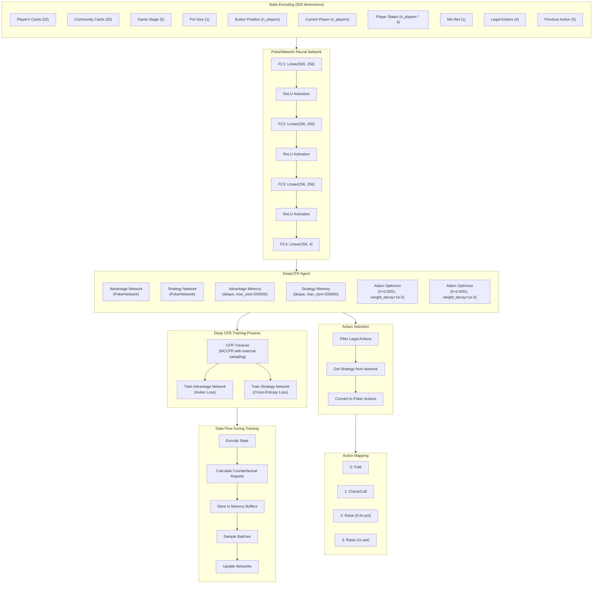

# DeepCFR Poker AI

A deep learning implementation of Counterfactual Regret Minimization (CFR) for No-Limit Texas Hold'em Poker. This project demonstrates advanced reinforcement learning techniques applied to imperfect information games.


> **Note:** This project builds on the straightforward and flexible [Pokers](https://github.com/Reinforcement-Poker/pokers) environment—a minimalistic no-limit Texas Hold'em simulator designed for reinforcement learning. Pokers cuts out the fuss by using a simple `new_state = state + action` model, making it really easy to integrate with any framework. While its simplicity is a major plus, it's also a side project that might have some bugs in less-tested areas. If you need rock-solid reliability, you might consider alternatives like RLCard. Huge thanks to the creators of Pokers for their innovative and accessible work!

## Overview

This repository implements Deep Counterfactual Regret Minimization (Deep CFR), an advanced reinforcement learning algorithm for solving imperfect information games. The implementation focuses on No-Limit Texas Hold'em Poker, one of the most challenging games for AI due to:

- Hidden information (opponents' cards)
- Stochastic elements (card dealing)
- Sequential decision-making
- Large state and action spaces

The agent learns by playing against random opponents and self-play, using neural networks to approximate regret values and optimal strategies.

## Architecture

The implementation consists of three main components:

1. **Model Architecture** (`model.py`)
   - Neural network definition
   - State encoding/representation
   - Forward pass implementation

2. **Deep CFR Agent** (`deep_cfr.py`) 
   - Advantage network for regret estimation
   - Strategy network for action selection
   - Memory buffers for experience storage
   - CFR traversal implementation
   - Training procedures

3. **Training Pipeline** (`train.py`)
   - Training loop implementation
   - Evaluation against random agents
   - Metrics tracking and logging
   - Model checkpointing and saving

### Architecture Diagram



## Technical Implementation

### Neural Networks

The project uses PyTorch to implement:

- **Advantage Network**: Predicts counterfactual regrets for each action
- **Strategy Network**: Outputs a probability distribution over actions

Both networks share a similar architecture:
- Fully connected layers with ReLU activations
- Input size determined by state encoding (cards, bets, game state)
- Output size matching the action space

### State Representation

Game states are encoded as fixed-length vectors that capture:
- Player hole cards (52 dimensions for card presence)
- Community cards (52 dimensions)
- Game stage (5 dimensions for preflop, flop, turn, river, showdown)
- Pot size (normalized)
- Player positions and button
- Current player
- Player states (active status, bets, chips)
- Legal actions
- Previous actions

### Action Space

The agent can select from four strategic actions:
- Fold
- Check/Call
- Raise 0.5x pot
- Raise 1x pot

### Counterfactual Regret Minimization

The implementation uses external sampling Monte Carlo CFR:
- Regret values are used to guide exploration
- Strategy improvement over iterations
- Regret matching for action selection
- Importance sampling for efficient learning

### Training Process

The training procedure includes:
- Data generation through game tree traversal
- Experience collection in memory buffers
- Regular network updates
- Periodic strategy network training
- Regular evaluation against random opponents
- Progress tracking via TensorBoard

## Performance Optimizations

The implementation includes various optimizations:
- Gradient clipping to prevent exploding gradients
- Huber loss for robust learning with outliers
- Regret normalization and clipping
- Linear CFR weighting for faster convergence
- Efficient memory management

## Requirements

- Python 3.8+
- PyTorch 1.9+
- NumPy
- Matplotlib
- TensorBoard
- [Pokers](https://github.com/Reinforcement-Poker/pokers) ("Embarrassingly simple" poker environment from Bruno Santidrian and 
Betagmr)

## Installation

```bash
# Clone the repository
git clone https://github.com/dberweger2017/deepcfr.git
cd deepcfr-poker

# Install dependencies
pip install -r requirements.txt

# Install the poker environment
pip install pokers
```

## Usage Guides

### DeepCFR Poker Training Guide

This guide provides a quick reference for training your Deep Counterfactual Regret Minimization (Deep CFR) poker agent using different methods.

#### Training Commands

##### Basic Training (vs Random Agents)

Train a new agent against random opponents:

```bash
python train.py --iterations 1000 --traversals 200
```

##### Continue Training from Checkpoint

Resume training from a saved checkpoint against random opponents:

```bash
python train.py --checkpoint models/checkpoint_iter_1000.pt --iterations 1000
```

##### Self-Play Training

Train against a fixed checkpoint opponent:

```bash
python train.py --checkpoint models/checkpoint_iter_1000.pt --self-play --iterations 1000
```

##### Mixed Checkpoint Training

Train against a rotating pool of checkpoint opponents:

```bash
python train.py --mixed --checkpoint-dir models --model-prefix t_ --refresh-interval 1000 --num-opponents 5 --iterations 1000
```

Continue an existing agent with mixed checkpoint training:

```bash
python train.py --mixed --checkpoint models/checkpoint_iter_1000.pt --checkpoint-dir models --model-prefix t_ --iterations 1000
```

#### Parameters

| Parameter | Description | Default |
|-----------|-------------|---------|
| `--iterations` | Number of training iterations | 1000 |
| `--traversals` | Number of game traversals per iteration | 200 |
| `--save-dir` | Directory to save model checkpoints | "models" |
| `--log-dir` | Directory for TensorBoard logs | "logs/deepcfr" |
| `--checkpoint` | Path to checkpoint file to continue training | None |
| `--verbose` | Enable detailed output | False |
| `--self-play` | Train against checkpoint instead of random agents | False |
| `--mixed` | Use mixed checkpoint training | False |
| `--checkpoint-dir` | Directory containing checkpoint models for mixed training | "models" |
| `--model-prefix` | Prefix for models to include in mixed training pool | "t_" |
| `--refresh-interval` | How often to refresh opponents in mixed training | 1000 |
| `--num-opponents` | Number of checkpoint opponents to use in mixed training | 5 |

#### Training Strategies

##### Random Opponent Training
- Fastest training method
- Good for initial learning
- Agent may overfit to exploit random play

##### Self-Play Training
- Trains against a fixed strong opponent
- Helps develop more balanced strategies
- May develop specific counter-strategies to the opponent

##### Mixed Checkpoint Training
- Most robust training method
- Prevents overfitting to specific opponent types
- Provides diverse learning experiences
- Closest approximation to Nash equilibrium training

#### Monitoring Training

Monitor training progress with TensorBoard:

```bash
tensorboard --logdir=logs
```

Then open http://localhost:6006 in your browser.

### Deep CFR Poker Play Guide

This guide will help you play against your trained Deep CFR poker agents using the interactive command-line interface.

#### Getting Started

To start a poker game against AI opponents, use one of the following scripts:

- `play_against_models.py` - Play against specifically selected models
- `play_against_random_models.py` - Play against randomly selected models from a directory

#### Play Commands

##### Playing Against Specific Models

```bash
python play_against_models.py --models models/model1.pt models/model2.pt models/model3.pt
```

##### Playing Against Random Models

```bash
python play_against_random_models.py --models-dir models
```

#### Command Line Options

| Option | Description | Default |
|--------|-------------|---------|
| `--models` | List of specific model paths to use as opponents | [] |
| `--models-dir` | Directory containing model checkpoint files | None |
| `--model-pattern` | File pattern to match model files (e.g., "*.pt") | "*.pt" |
| `--num-models` | Number of models to select randomly | 5 |
| `--position` | Your position at the table (0-5) | 0 |
| `--stake` | Initial chip stack for all players | 200.0 |
| `--sb` | Small blind amount | 1.0 |
| `--bb` | Big blind amount | 2.0 |
| `--verbose` | Show detailed debug output | False |
| `--no-shuffle` | Keep the same random models for all games | False |

#### Game Interface

During gameplay, you'll see the current game state displayed, including:

- Your hand cards
- Community cards
- Pot size
- Position of each player
- Current bets
- Available actions

#### Available Actions

When it's your turn to act, you can use these commands:

| Command | Action |
|---------|--------|
| `f` | Fold |
| `c` | Check (if available) or Call |
| `r` | Raise (custom amount) |
| `h` | Raise half the pot |
| `p` | Raise the full pot amount |
| `m` | Raise a custom amount |

For raises, you can use the shortcuts above or enter a custom amount when prompted.

#### Example Game State

```
======================================================================
Stage: Flop
Pot: $12.00
Button position: Player 3

Community cards: 2♥ K♠ 10♣

Your hand: A♥ K♥

Players:
Player 0 (YOU): $195.00 - Bet: $3.00 - Active
Player 1 (AI): $195.00 - Bet: $3.00 - Active
Player 2 (AI): $200.00 - Bet: $0.00 - Folded
Player 3 (AI): $198.00 - Bet: $2.00 - Active
Player 4 (AI): $199.00 - Bet: $1.00 - Active
Player 5 (AI): $195.00 - Bet: $3.00 - Active

Legal actions:
  c: Check
  r: Raise (min: $3.00, max: $195.00)
    h: Raise half pot
    p: Raise pot
    m: Custom raise amount
======================================================================
```

#### Advanced Usage

##### Playing Against Models of Different Strengths

```bash
# Use only models that have been trained for at least 1000 iterations
python play_against_random_models.py --models-dir models --model-pattern "*_iter_1???.pt" 
```

##### Mixing in Random Agents

```bash
# Use only 2 trained models, the rest will be random agents
python play_against_random_models.py --models-dir models --num-models 2
```

##### Changing Table Position

```bash
# Play from the button position (typically position 5 in 6-player game)
python play_against_random_models.py --models-dir models --position 5
```

## Results

After training, the agent achieves:
- Positive expected value against random opponents
- Increasing performance over training iterations
- Sophisticated betting strategies


## Future Work

- Implement opponent modeling
- Expand the action space with more bet sizing options
- Experiment with alternative network architectures (CNN, Transformers)
- Parallel data generation for faster training
- Develop a more diverse set of evaluation opponents

## References

1. Brown, N., & Sandholm, T. (2019). [Deep Counterfactual Regret Minimization](https://arxiv.org/abs/1811.00164). *ICML*.
2. Zinkevich, M., Johanson, M., Bowling, M., & Piccione, C. (2008). [Regret Minimization in Games with Incomplete Information](https://papers.nips.cc/paper/3306-regret-minimization-in-games-with-incomplete-information.pdf). *NIPS*.
3. Heinrich, J., & Silver, D. (2016). [Deep Reinforcement Learning from Self-Play in Imperfect-Information Games](https://arxiv.org/abs/1603.01121). *arXiv preprint*.

## License

This project is licensed under the MIT License - see the [LICENSE](https://github.com/dberweger2017/deepcfr/blob/main/LICENSE.txt) file for details.

In non-lawyer terms: Do whatever you want with this software. If you use my code or models without making significant modifications, I'd appreciate it if you acknowledged my work.

## Acknowledgments

- The creators and maintainers of [Reinforcement-Poker/pokers](https://github.com/Reinforcement-Poker/pokers) for providing a straightforward and effective poker environment that really makes the project shine
- The [Annual Computer Poker Competition](http://www.computerpokercompetition.org/) for inspiration
- [OpenAI](https://openai.com/) and [DeepMind](https://deepmind.com/) for pioneering work in game AI
- The PyTorch team for their excellent deep learning framework